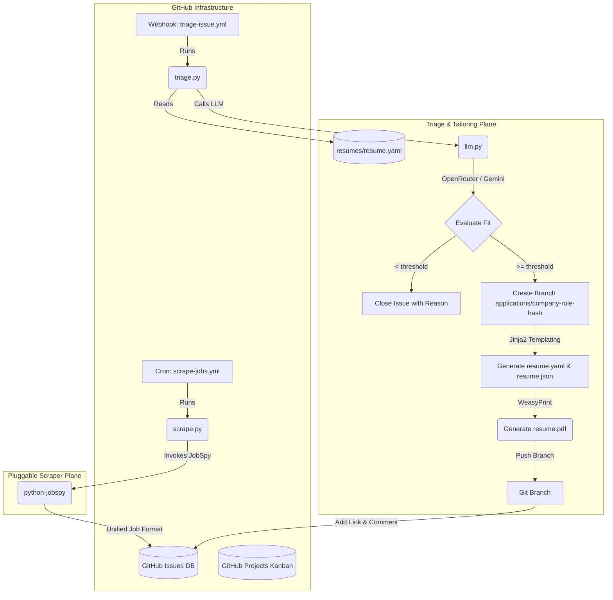

# JobGitOps Development Guide

This guide is for developers and contributors looking to understand the architecture, inner workings, and development workflows of JobGitOps. 

For end-user installation, setup, and configuration instructions, please refer to the main [README.md](README.md).

---

## System Architecture

JobGitOps is designed to run entirely "serverless" on GitHub's free execution infrastructure, using GitHub Actions as the processing plane and GitHub Issues/Projects as the database and user interface.



---

## Workflows

The following GitHub Actions workflows manage the automated lifecycle of the scraper, triage agent, issue assistant, and board synchronization:

| Workflow | Trigger | What it does |
| --- | --- | --- |
| `scrape-jobs.yml` | Daily cron (`0 0 * * *`) or `workflow_dispatch` | Scrapes job boards, dedupes, opens `triage-pending` issues, then auto-triages any pending issues |
| `triage-issue.yml` | Issue labeled `triage-pending` | Runs the two-pass LLM triage/tailor pipeline |
| `respond-issue.yml` | Issue comment created or issue opened | Runs the Issue Assistant: answers thread questions with web research, applies status labels from conversational intents, and auto-triages bare job-URL submissions |
| `status-transition.yml` | Issue labeled with a lifecycle label or closed | Moves the issue card to the matching Projects V2 column |
| `project-status-sync.yml` | Schedule (every 30m) or `workflow_dispatch` | Reverse sync: applies the label matching a card's new column (skips Triage Pending) |
| `ci.yml` | Push/PR to `main` | Runs `just validate` (lint + format + 90% coverage tests) inside the pre-built container |
| `pr-review.yml` | PR opened, reopened, or marked ready for review (dependabot skipped) | Automated code review via OpenRouter |
| `sync-labels.yml` | Push to `main` | Applies issue labels from `.github/labels.yml` and migrates renamed labels (e.g. `interviewing` → `in-loop`) |

These workflows run inside a pre-built Docker container hosting WeasyPrint libraries and uv, avoiding runner bootstrap delays.

---

## Issue Labels & Lifecycle

Labels (names, colors, descriptions) are managed as code in `.github/labels.yml` and applied automatically by `.github/workflows/sync-labels.yml` on every push to `main`. Keep both files together when forking or vendoring this repo — the triage engine adds labels that must already exist. 

### Label Lifecycle Progression

1. **Discovery**: Scraper creates an issue and labels it `triage-pending`.
2. **Evaluation**:
   - **Below threshold**: Issue is labeled `triage-mismatched` + category reason labels (e.g. `salary-mismatch`, `location-mismatch` if scored below 3 in those dimensions), a breakdown is posted, and the issue is closed.
   - **Above threshold**: Issue is labeled with its fit grade (`fit:A+`, `fit:A`, or `fit:B`) + `ready-to-apply`.
3. **Application & Tracking**:
   - You apply for the role and label the issue `applied` (or the Issue Assistant detects this intent from a comment like "I applied" and labels it for you).
   - As you progress, the labels transition to `in-loop` (for interviews), `offer-received` (for offers), or `rejected`.

---

## Local Development

We use `devenv` and `nix` to manage system dependencies (like Cairo and Pango required for WeasyPrint HTML-to-PDF rendering) and Python dependencies reproducibly.

> [!NOTE]
> Detailed developer environment configuration rules and issue tracking rules are in [AGENTS.md](AGENTS.md).

### Environment Setup

Enter the shell environment to load all native and Python dependencies:

```bash
devenv shell    # or `direnv allow` to auto-load on cd
```

### Development Tasks (`Justfile`)

We use `just` as our task runner. Run these tasks inside the `devenv shell`:

```bash
just validate   # Run linting, formatting checks, and test suites (90% coverage gate)
just format     # Auto-format codebase (uses Ruff) and the canonical resume fixture
just lint       # Run Ruff lints
```

### Running Tests

Targeted test execution for the Python engine with `pytest`:

```bash
pytest                                       # Run entire test suite
pytest tests/test_schemas.py                 # Run a specific test file
pytest tests/test_triage.py::test_grade_fit  # Run a specific test case
```

Targeted test execution for the TypeScript installer package with `vitest`:

```bash
npm test --prefix installer                  # Run Vitest test suite with coverage
```

### Project Sync & Reconciliation CLI

The `project_sync` CLI utility helps initialize Projects V2 columns and reconcile status mismatch states between board columns and issue labels:

```bash
# Set up GITHUB variables
export GITHUB_TOKEN="ghp_..."
export GITHUB_REPOSITORY="owner/repo"

# Run setup commands
python -m jobgitops.cli.project_sync field-options              # Initialize/prune Projects V2 columns
python -m jobgitops.cli.project_sync backfill --reverse         # Reconcile board columns to issue labels
```

### Local Troubleshooting & Resolution Tips

- **Missing Cairo / Pango Libraries (`OSError: dlopen`)**:
  WeasyPrint requires native system libraries mapped by Nix. Always enter the environment via `devenv shell` or enable `direnv allow` before executing Python scripts or test suites. Running development commands directly on the host system will fail.
- **Coverage Gate Failures**:
  If `just validate` fails the 90% test coverage requirement, run coverage with term-missing line reporting to find untested blocks:
  ```bash
  pytest --cov=src/jobgitops --cov-report=term-missing tests/
  ```
- **Dry-Run Local Scraping & Validation**:
  Test scraping and resume format checking locally without creating remote GitHub issues:
  ```bash
  python -m jobgitops.cli.scrape --dry-run
  python -m jobgitops.cli.validate_resume resumes/resume.yaml
  ```

---

## Repository Layout

```text
src/jobgitops/cli/            # CLI entry points (scrape, triage, respond, status_transition, project_sync)
src/jobgitops/                # Core library (llm, renderer, git_ops, github_client, schema, loader, fit_grades, scraper, status_model)
scripts/format_resume.py      # Canonical resume.yaml formatter
installer/                    # TypeScript bootstrap installer package (see [specs/bootstrap-installer.md](specs/bootstrap-installer.md))
template/                     # Installer user-repo content: config defaults, placeholder resume, renderer templates, README, .gitignore
tests/                        # pytest suite (90% coverage enforced)
tests/fixtures/               # Committed fixture config + resume used by tests and the formatter
specs/                        # Architecture specs + user stories
```

---

## Developer Fork-and-Run Setup

While the interactive installer package is the recommended installation path, JobGitOps can also be set up manually by developers testing modifications in a personal fork:

1. **Fork the repository** to your personal GitHub account.
2. **Configure secrets & variables** — see the [API Key Setup](README.md#api-key-setup) section in the main README.
3. **Customize your resume & preferences** — see the [Configuration](README.md#configuration) section in the main README.
4. **Enable Actions**: open the **Actions** tab in your fork and click *"I understand my workflows, go ahead and enable them"* (required by GitHub for all forks).
5. **Run**: the daily cron automatically begins scraping, and the triage webhook triages every new listing. You can also trigger a scrape manually anytime via the **Run workflow** button under the **Actions** tab with optional overrides (work preference, job type, hours, dry-run).
