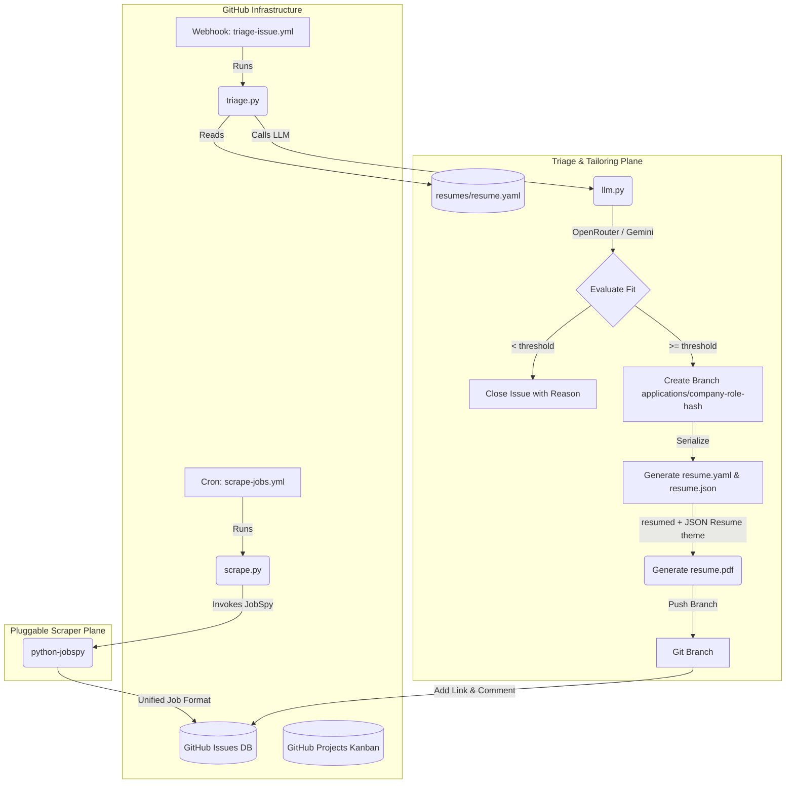

# JobGitOps Development Guide

This guide is for developers and contributors looking to understand the architecture, inner workings, and development workflows of JobGitOps. 

For end-user installation, setup, and configuration instructions, please refer to the main [README.md](README.md).

---

## System Architecture

JobGitOps is designed to run entirely "serverless" on GitHub's free execution infrastructure, using GitHub Actions as the processing plane and GitHub Issues/Projects as the database and user interface.



---

## Workflows

The following GitHub Actions workflows manage the automated lifecycle of the scraper, triage agent, issue assistant, and board synchronization:

| Workflow | Trigger | What it does |
| --- | --- | --- |
| `scrape-jobs.yml` | Daily cron (`0 0 * * *`) or `workflow_dispatch` | Scrapes job boards, dedupes, opens `triage-pending` issues, then auto-triages any pending issues |
| `triage-issue.yml` | Issue labeled `triage-pending` | Runs the two-pass LLM triage/tailor pipeline |
| `respond-issue.yml` | Issue comment created or issue opened | Runs the Issue Assistant: answers thread questions with web research, applies status labels from conversational intents, and auto-triages bare job-URL submissions |
| `status-transition.yml` | Issue labeled with a lifecycle label or closed | Moves the issue card to the matching Projects V2 column |
| `project-status-sync.yml` | Schedule (every 30m) or `workflow_dispatch` | Reverse sync: applies the label matching a card's new column (skips Triage Pending) |
| `gmail-sync.yml` | Hourly cron (`0 * * * *`) or `workflow_dispatch` | Optional, off by default. Matches DMARC-authenticated lifecycle emails in a label-scoped slice of Gmail to open applications and applies the same status-update side effects as the Issue Assistant |
| `esd-export.yml` | `workflow_dispatch` only | Exports job-search activity (`applied`/`in-loop` label history) as a CSV/XLSX file, uploaded as a workflow artifact, for filing with a state unemployment department — see [`specs/esd-export.md`](specs/esd-export.md) |
| `ci.yml` | Push/PR to `main` | Runs `just validate` (lint + format + 90% coverage tests) inside the pre-built container |
| `pr-review.yml` | PR opened, reopened, or marked ready for review (dependabot skipped) | Automated code review via OpenRouter |
| `sync-labels.yml` | Push to `main` | Applies issue labels from `.github/labels.yml` and migrates renamed labels (e.g. `interviewing` → `in-loop`) |

These workflows run inside a pre-built Docker container hosting Bun, Chromium/Puppeteer, and uv, avoiding runner bootstrap delays.

### Running the ESD Export

`esd-export.yml` is manual-only — there's no cron, since ESD filings happen
on the agency's schedule, not JobGitOps's. To run it: open the **Actions**
tab, select **ESD Export**, click **Run workflow**, and fill in the inputs:

- **group_by** (`weekly`/`monthly`) and, if weekly, **week_start** — how
  activity is bucketed into reporting periods.
- **format** (`csv`/`xlsx`) — the output spreadsheet format.
- **max_per_period** — a positive integer to cap rows per period (e.g. `3`
  for a state that only accepts 3 activities/week), or `unlimited`.
- **start_date** / **end_date** (`YYYY-MM-DD`, optional) — leave blank for
  the full history through today.

The run uploads its result as a workflow artifact named `esd-export`
(download it from the completed run's summary page). GitHub Actions always
wraps artifact downloads in a `.zip` regardless of how many files are
inside — that's a platform behavior, not something this workflow controls.
`gh run download <run-id>` (GitHub CLI) extracts it for you automatically,
so you get the raw `.csv`/`.xlsx` directly without unzipping anything
yourself. See [`specs/esd-export.md`](specs/esd-export.md) for the full design, including
what counts as an "activity" and how periods/dedup/caps work.

---

## Issue Labels & Lifecycle

Labels (names, colors, descriptions) are managed as code in `.github/labels.yml` and applied automatically by `.github/workflows/sync-labels.yml` on every push to `main`. Keep both files together when forking or vendoring this repo — the triage engine adds labels that must already exist. 

### Label Lifecycle Progression

1. **Discovery**: Scraper creates an issue and labels it `triage-pending`.
2. **Evaluation**:
   - **Below threshold**: Issue is labeled `triage-mismatched` + category reason labels (e.g. `salary-mismatch`, `location-mismatch` if scored below 3 in those dimensions), a breakdown is posted, and the issue is closed.
   - **Above threshold**: Issue is labeled with its fit grade (`fit:A+`, `fit:A`, or `fit:B`) + `ready-to-apply`.
3. **Application & Tracking**:
   - You apply for the role and label the issue `applied` (or the Issue Assistant detects this intent from a comment like "I applied" and labels it for you).
   - As you progress, the labels transition to `in-loop` (for interviews), `offer-received` (for offers), or `rejected`.

---

## Local Development

We use `devenv` and `nix` to manage system dependencies (fonts for PDF rendering fidelity, `just`, `shellcheck`) and Python dependencies reproducibly.

> [!NOTE]
> Detailed developer environment configuration rules and issue tracking rules are in [AGENTS.md](AGENTS.md).

### Environment Setup

Enter the shell environment to load all native and Python dependencies:

```bash
devenv shell    # or `direnv allow` to auto-load on cd
```

### Development Tasks (`Justfile`)

We use `just` as our task runner. Run these tasks inside the `devenv shell`:

```bash
just validate   # Run linting, formatting checks, and test suites (90% coverage gate)
just format     # Auto-format codebase (uses Ruff) and the canonical resume fixture
just lint       # Run Ruff lints
```

### Running Tests

Targeted test execution for the Python engine with `pytest`:

```bash
pytest                                       # Run entire test suite
pytest tests/test_schemas.py                 # Run a specific test file
pytest tests/test_triage.py::test_grade_fit  # Run a specific test case
```

Targeted test execution for the TypeScript installer package with `vitest`:

```bash
npm test --prefix installer                  # Run Vitest test suite with coverage
```

### Project Sync and Reconciliation CLI

The `project_sync` CLI utility helps initialize Projects V2 columns and reconcile status mismatch states between board columns and issue labels:

```bash
# Set up GITHUB variables
export GITHUB_TOKEN="ghp_..."
export GITHUB_REPOSITORY="owner/repo"

# Run setup commands
python -m jobgitops.cli.project_sync field-options              # Initialize/prune Projects V2 columns
python -m jobgitops.cli.project_sync backfill --reverse         # Reconcile board columns to issue labels
```

### Local Troubleshooting & Resolution Tips

- **Coverage Gate Failures**:
  If `just validate` fails the 90% test coverage requirement, run coverage with term-missing line reporting to find untested blocks:
  ```bash
  pytest --cov=src/jobgitops --cov-report=term-missing tests/
  ```
- **Dry-Run Local Scraping & Validation**:
  Test scraping and resume format checking locally without creating remote GitHub issues:
  ```bash
  python -m jobgitops.cli.scrape --dry-run
  python -m jobgitops.cli.validate_resume resumes/resume.yaml
  ```

---

## Repository Layout

```text
src/jobgitops/cli/            # CLI entry points (scrape, triage, respond, status_transition, project_sync)
src/jobgitops/                # Core library (llm, renderer, git_ops, github_client, schema, loader, fit_grades, scraper, status_model)
scripts/format_resume.py      # Canonical resume.yaml formatter
installer/                    # TypeScript bootstrap installer package (see [specs/bootstrap-installer.md](specs/bootstrap-installer.md))
template/                     # Installer user-repo content: config defaults, placeholder resume, README, .gitignore
tests/                        # pytest suite (90% coverage enforced)
tests/fixtures/               # Committed fixture config + resume used by tests and the formatter
specs/                        # Architecture specs + user stories
```

---

## Developer Fork-and-Run Setup

While the interactive installer package is the recommended installation path, JobGitOps can also be set up manually by developers testing modifications in a personal fork:

1. **Fork the repository** to your personal GitHub account.
2. **Configure secrets & variables** — see [API Key Setup](#api-key-setup) below.
3. **Customize your resume & preferences** — see the [Configuration](README.md#configuration) section in the main README.
4. **Enable Actions**: open the **Actions** tab in your fork and click *"I understand my workflows, go ahead and enable them"* (required by GitHub for all forks).
5. **Run**: the daily cron automatically begins scraping, and the triage webhook triages every new listing. You can also trigger a scrape manually anytime via the **Run workflow** button under the **Actions** tab with optional overrides (work preference, job type, hours, dry-run).

### API Key Setup

Configure the following secrets and variables under **Settings > Secrets and variables > Actions** in your fork.

#### Secrets

| Secret | Required | Purpose |
| --- | --- | --- |
| `GEMINI_API_KEY` | One of the three | Gemini provider key (from [Google AI Studio](https://aistudio.google.com/)) |
| `OPENROUTER_API_KEY` | One of the three | OpenRouter provider key — also powers the automated PR review |
| `CLAUDE_CODE_OAUTH_TOKEN` | One of the three | Claude provider credential: supports either a Claude Code subscription OAuth token (`sk-ant-oat...` generated via `claude setup-token`) or a standard Anthropic API key (`sk-ant-api03...`); auto-detected at runtime |
| `GH_PAT` | Optional | GitHub Personal Access Token. Serves as the single pipeline token for Projects V2, Gist status badges, and repository mutations. Falls back to `GITHUB_TOKEN` only when **unset** |
| `TAVILY_API_KEY` | Optional | Enables the `tavily` search provider for the Issue Assistant's web research |
| `BRAVE_API_KEY` | Optional | Enables the `brave` search provider for the Issue Assistant's web research |
| `JINA_API_KEY` | Optional | Free key (jina.ai) for the Jina Reader fallback on JS-heavy job boards; raises the anonymous 20 RPM limit to 500 RPM |
| `GMAIL_CLIENT_ID` | Optional | Required only to enable Gmail Sync (`config/settings.yaml`'s `gmail.enabled: true`) — see [Gmail Sync Setup](#gmail-sync-setup-optional) below |
| `GMAIL_CLIENT_SECRET` | Optional | Required only to enable Gmail Sync, paired with `GMAIL_CLIENT_ID` |
| `GMAIL_REFRESH_TOKEN` | Optional | Required only to enable Gmail Sync; long-lived, scoped to `gmail.readonly` only |

> [!NOTE]
> At least one of `GEMINI_API_KEY`, `OPENROUTER_API_KEY`, or `CLAUDE_CODE_OAUTH_TOKEN` is required for triage. If `GH_PAT` is omitted, the workflows use the built-in `GITHUB_TOKEN` (enough for issues, contents, and PRs; Projects V2 automation and Gist status badges then degrade/skip) — provided **Settings > Actions > General > Workflow permissions** is set to *Read and write permissions*. Note that `${{ secrets.A || secrets.B }}` selects `GH_PAT` whenever it is non-empty: a stale, revoked, or under-scoped token is used preferentially and fails rather than falling back, so replace — don't just remove — a bad token. We recommend using **Fine-Grained Personal Access Tokens (Beta)** scoped strictly to your job search repository.

#### Variables

| Variable | Default | Purpose |
| --- | --- | --- |
| `LLM_PROVIDER` | auto-detected | `gemini`, `openrouter`, or `claude` (auto-detected from keys when unset) |
| `GEMINI_MODEL` | `models/gemini-2.5-flash` | Gemini model (`models/` prefix recommended; bare `gemini-*` names also accepted) |
| `OPENROUTER_MODEL` | `openrouter/free` | OpenRouter model, provider prefix required. Also drives the PR-review action, where it inherits this default or falls back to `openrouter/free` |
| `CLAUDE_MODEL` | `claude-sonnet-5` | Claude model (e.g., `claude-sonnet-5` or `claude-haiku-4-5-20251001`) |
| `OPENROUTER_BASE_URL` | `https://openrouter.ai/api/v1/chat/completions` | OpenRouter endpoint used by the PR-review action |
| `OPENROUTER_MAX_TOKENS` | `4096` | Max tokens for the PR-review action |

### Enabling Projects V2 Manually

If you choose to enable the Projects V2 Kanban board manually on your fork:

1. **Get your project's node ID** — the `PVT_...` identifier, *not* the `N` number shown in the board URL. In a terminal:

   ```bash
   gh api graphql -f query='query { viewer { projectV2(number: 1) { id } } }'
   ```

   (Replace `1` with your board's number.) Copy the returned `"PVT_..."` string into `config/settings.yaml`.

2. **Add a `GH_PAT` secret** with `project` (read) plus `repo`, `workflow`, and `gist` scopes — see [API Key Setup](#api-key-setup) above.

   > [!IMPORTANT]
   > This token is mandatory for full two-way sync: the built-in `GITHUB_TOKEN` cannot write to Projects V2, so without it the workflows fall back to label-only tracking even when `project_id` is set.

3. **Sync the board and options** — the lifecycle columns (`Triage Pending`, `Ready to Apply`, `Applied`, `In Loop`, `Offer Received`, `Rejected`, `Mismatched/Closed`) must exist on your Status field before cards can move. 

   You can initialize status options and reconcile cards by running:
   ```bash
   devenv shell -- python -m jobgitops.cli.project_sync field-options   # create missing options
   devenv shell -- python -m jobgitops.cli.project_sync backfill --reverse   # one-time reconciliation
   devenv shell -- python -m jobgitops.cli.project_sync field-options --prune   # drop stale defaults (e.g. Done)
   ```

   > [!TIP]
   > Run the prune step once cards are off the default columns: removing the `Done` option permanently disarms GitHub's built-in "item closed → Done" automation, which otherwise races the pipeline's own column moves on every issue close (see `ensure_project_status` in `src/jobgitops/github_client.py`).

### Gmail Sync Setup (Optional)

Gmail Sync (`gmail-sync.yml`) is off by default: `config/settings.yaml` has no `gmail` section until you enable one. Enabling it always needs your own Google Cloud OAuth client (never a JobGitOps-shared one — see below) plus a Gmail label/filter; from there you can either let the **installer wizard automate the rest**, or do it **manually** (required if you're adding Gmail Sync to an already-installed repo, or setting it up headless).

1. **Create a Google Cloud project** at [console.cloud.google.com](https://console.cloud.google.com/), then enable the **Gmail API** for it (APIs & Services > Library > search "Gmail API" > Enable).

2. **Add yourself as a test user — do not skip this.** APIs & Services > **OAuth consent screen** > **Audience** tab > **Test users** > add your own Google account's email > Save. Test-mode consent screens work indefinitely for the developer's own account — no Google review needed, since only you ever authorize this client. *(A single JobGitOps-shared OAuth client would let the wizard skip this step entirely, but `gmail.readonly` is a restricted scope: a shared client serving many different users' accounts would need to pass Google's app verification/security assessment, and every user would see an "unverified app" warning until then. Keeping the client per-user avoids that entirely.)*

   > [!WARNING]
   > Skipping this step is the single most common snag: you'll get all the way through the Google sign-in and see **"Access blocked: `<app name>` has not completed the Google verification process... The app is currently being tested, and can only be accessed by developer-approved testers"** instead of the permission screen. If you hit that, this is the step you missed — go add yourself as a test user and try again.

3. **Create an OAuth client ID**: APIs & Services > **OAuth consent screen** > **Overview** tab > **Create OAuth Client** > application type **Desktop app** (not Web application — Desktop app is required for the redirect to work, since only that type gets automatic support for the loopback address this integration redirects to). Copy the generated **Client ID** and **Client Secret** — you'll need both for either path below.

4. **Create a Gmail label and filter** to scope what this integration ever reads. `gmail_sync.py` only ever lists messages scoped to that exact label (via the Gmail API's `labelIds` parameter) within the last `days_back` days, so the label — and whatever filter rule applies it — is a real part of the trust boundary, not just an organizational convenience: the `gmail.readonly` OAuth scope grants read access to your whole mailbox (Gmail has no way to scope a grant to a single label), so only what your filter labels ever enters the matching pipeline. **Recommend scoping the filter to known ATS/recruiter senders or domains** (e.g. `from:(greenhouse.io OR lever.co OR myworkday.com)`) rather than broad keyword matching (e.g. a bare `subject:(interview)` filter), since anything auto-labeled is DMARC-checked and passed to the matching LLM call.

   **Even simpler and more precise:** if your provider supports address tagging (e.g. Gmail's native `+` addressing), apply for jobs using a dedicated alias like `you+jobsearch@gmail.com` instead of your main address, then create a Gmail filter scoped to that exact `to:` address. Every ATS/recruiter reply naturally lands on an address only job applications ever use, so the filter needs no sender-domain guessing — label everything sent to the alias and you're done.

5. **Get your refresh token, secrets, and config set up** — pick one:

   **Automated (recommended, during initial repo setup only):** run the installer (`npx jobgitops-installer`) and answer "yes" when it asks about Gmail Sync. If you don't have a Client ID/Secret yet, say so when asked and it opens the Google Cloud Console credentials page for you, printing steps 1-3 above right in your terminal. Paste the resulting Client ID/Secret in, plus your label from step 4; it then opens your browser to Google's consent screen, catches the redirect on a short-lived local server (nothing is ever typed or copy-pasted), exchanges the code for a refresh token, and writes `GMAIL_CLIENT_ID`/`GMAIL_CLIENT_SECRET`/`GMAIL_REFRESH_TOKEN` to your repo's secrets plus `gmail.enabled`/`gmail.label` into `config/settings.yaml` for you. Non-interactive/scripted installs can pass `--gmail --gmail-client-id ... --gmail-client-secret ... --gmail-refresh-token ...` (mint the token manually first, per below) or `--gmail-label`; see `npx jobgitops-installer --help`.

   **Manual (for an already-installed repo, or a headless machine):** mint the refresh token yourself, once, in a scratch virtual environment (`google-auth-oauthlib` is intentionally not a project dependency, since nothing in the shipped engine needs it — only this one-time script does):

   ```bash
   pip install google-auth-oauthlib
   python3 - <<'EOF'
   from google_auth_oauthlib.flow import InstalledAppFlow

   SCOPES = ["https://www.googleapis.com/auth/gmail.readonly"]
   flow = InstalledAppFlow.from_client_config(
       {
           "installed": {
               "client_id": "YOUR_CLIENT_ID",
               "client_secret": "YOUR_CLIENT_SECRET",
               "auth_uri": "https://accounts.google.com/o/oauth2/auth",
               "token_uri": "https://oauth2.googleapis.com/token",
           }
       },
       SCOPES,
   )
   creds = flow.run_local_server(port=0)
   print(creds.refresh_token)
   EOF
   ```

   A browser window opens for you to sign in and consent; the script then prints a refresh token. The scope requested is read-only (`gmail.readonly`) — this integration never sends, modifies, or deletes mail.

   On a headless machine with no local browser, replace the last two lines with a copy-paste variant instead of `run_local_server()` — nothing needs to actually listen on `localhost` for this to work, since Desktop-app clients support any `localhost` redirect port and the authorization code lands in the (never-loading) redirect URL's address bar regardless:

   ```python
   flow.redirect_uri = "http://localhost:8080"
   print(flow.authorization_url(access_type="offline", prompt="consent")[0])
   # Open that URL in any browser, on any device, sign in and approve.
   # It redirects to http://localhost:8080/?code=...&scope=... and fails
   # to load -- copy the `code` value straight out of the address bar.
   flow.fetch_token(code=input("Paste the code: ").strip())
   print(flow.credentials.refresh_token)
   ```

   Then add the three secrets (`GMAIL_CLIENT_ID`, `GMAIL_CLIENT_SECRET`, `GMAIL_REFRESH_TOKEN`) under **Settings > Secrets and variables > Actions**, and enable it in `config/settings.yaml`:

   ```yaml
   gmail:
     enabled: true
     label: "JobGitOps"   # must exactly match the label name you created in step 4
   ```

> [!NOTE]
> Every comment `gmail-sync.yml` posts links back to the original Gmail message via a permalink of the form `https://mail.google.com/mail/u/0/#all/{message_id}`. The `u/0` segment assumes your browser's *primary* signed-in Google account owns the integration. If you use the Gmail account tied to this integration as a secondary (`u/1`, `u/2`, ...) signed-in account in your browser, the link will open your primary account's mailbox instead — sign out of other accounts first, or manually adjust the `u/N` index in the URL.
