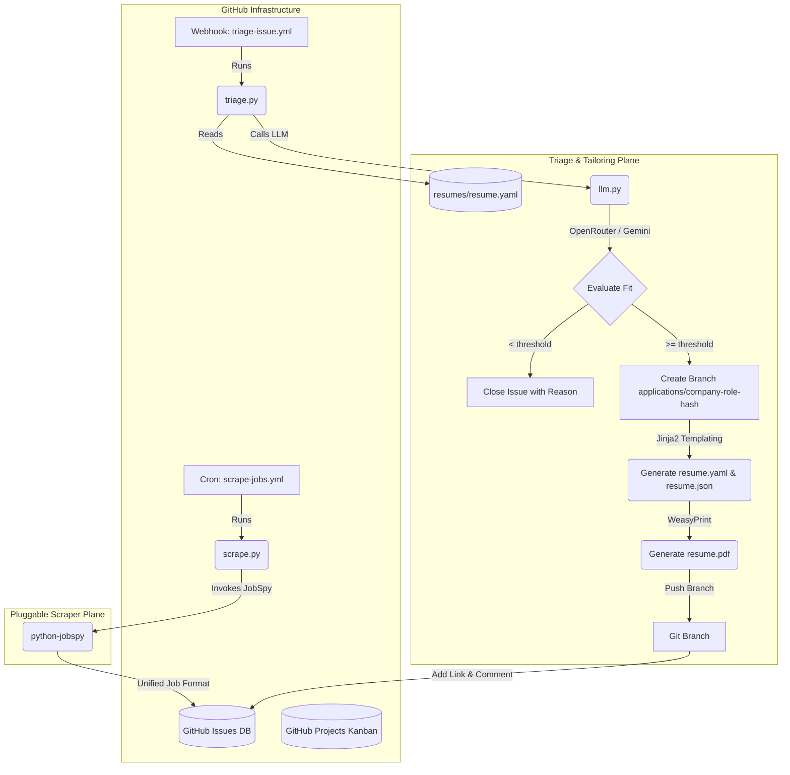

# JobGitOps

A serverless, GitOps-driven job application and tracking system. JobGitOps treats the job search like software deployment: GitHub Issues are your pipeline, GitHub Projects is your Kanban board, and GitHub Actions is the automation plane that scrapes roles, AI-triages fit, and tailors your resume — all running free on GitHub's infrastructure.

## Features

- 🤖 **Automated Role Discovery**: A scheduled Actions cron (`src/scrape.py`) scrapes LinkedIn, Indeed, and ZipRecruiter via `python-jobspy`, generating search queries from your resume skills, and files new roles as GitHub Issues labeled `triage-pending`.
- 🧠 **AI Triage & Tailoring**: A two-pass LLM engine (`src/triage.py`) scores each listing against your resume across 5 dimensions (tech stack, experience, location, salary, domain). Matches above your `fit_threshold` get a tailored resume; mismatches are auto-closed with a reasons comment.
- 📄 **Resume-as-Code**: Your base resume lives in versioned YAML (`resumes/resume.yaml`, JSON Resume schema). Tailored variants are rendered to HTML and print-ready PDFs with Jinja2 + WeasyPrint on dedicated application branches — every version you send is a clean, reviewable Git diff.
- 💬 **Issue Assistant**: A tool-using agent (`src/respond.py`) answers questions on issue threads via live web research (search + fetch with cited sources), recognizes conversational status intents ("I applied", "phone screen scheduled") to apply labels, and auto-triages issues opened with a bare job URL.
- 🗂️ **Kanban Lifecycle Tracking**: Roles flow through GitHub Issues + Projects V2 (`Triage Pending → Ready to Apply → Applied → In Loop → Rejected`) with label-based automation and a label-only fallback.
- ❄️ **Hermetic Nix Environment**: Reproducible Python 3.12 + `devenv` shell with all WeasyPrint native deps (`cairo`, `pango`, `glib`, `gdk-pixbuf`, `harfbuzz`, `libffi`) and fonts mapped cleanly.
- 🛠️ **Local Task Runner (`Justfile`)**: Standardized commands for formatting, linting, and validating with a 90% coverage gate.
- 🛡️ **Git Hooks**: Pre-configured pre-commit quality gate (`just validate`) and conventional commit title verification.
- 👀 **Automated PR Reviews**: Integrated via `menil/pr-code-review-action` using OpenRouter.

## System Architecture



## Getting Started

> Detailed developer-environment, quality-gate, and issue-tracking instructions are in [AGENTS.md](AGENTS.md).

## Fork-and-Run: The JobGitOps Way

JobGitOps is designed to run entirely "out-of-the-box" on GitHub's free execution infrastructure. To set it up for your own job search:

1. **Fork the repository** to your personal GitHub account.
2. **Configure secrets & variables** — see [API Key Setup](#api-key-setup).
3. **Customize your resume & preferences** — see [Configuration](#configuration).
4. **Enable Actions**: open the **Actions** tab in your fork and click *"I understand my workflows, go ahead and enable them"* (required by GitHub for all forks).
5. **Run**: the daily cron automatically begins scraping, and the [triage-issue.yml](#workflows) webhook triages every new listing. You can also trigger a scrape anytime via the **Run workflow** button with optional overrides (location, job type, hours, dry-run).

### The Daily Flow

1. **Discovery** — The cron scrapes job boards, dedupes against the ~500 most recent roles already in your repo, and opens new candidates as issues labeled `triage-pending`.
2. **Triage** — The LLM scores each job against your base resume. Below `fit_threshold` → the issue is labeled `triage-mismatched` plus a red reason label for each dimension scored below 3 (e.g. `salary-mismatch`, `location-mismatch`), a mismatch breakdown is commented, and the issue is closed.
3. **Tailoring** — Above threshold → a dedicated branch `applications/<company>-<role>-<hash>` is created. `resumes/resume.yaml` is subtly tailored, a JSON version is generated, and a print-ready PDF is compiled. All three files are committed and pushed, and a comment links the fit score and the browser-viewable PDF.
4. **Apply & Track** — Review the diff, submit the PDF, then label the issue `applied` to move the card to `Applied` on your board. Track `in-loop` / `rejected` from there.

## Configuration

### `config/settings.yaml`

Controls search preferences and the triage threshold:

```yaml
# Minimum fit score (1.0 to 5.0) required to tailor a resume and apply.
fit_threshold: 3.5

search:
  location: "Remote"                    # Target location (e.g. "Seattle, WA")
  job_type: "fulltime"                  # fulltime | contract | parttime | internship
  platforms:
    - linkedin                          # Job boards to search
  hours_old: 24                         # Only jobs posted in the last N hours

# Optional Issue Assistant research settings (see specs/assistant-agent.md).
# research:
#   search_provider: duckduckgo       # duckduckgo | tavily | brave
#   max_results: 5
#   max_iterations: 6                 # agent tool-loop cap
#   max_context_comments: 10          # recent comments fed to the model
#   timeout_seconds: 15               # per-request fetch timeout
#   total_timeout_seconds: 30         # total request budget (incl. redirects)
#   max_redirects: 5
#   max_content_bytes: 1048576        # 1 MiB
#   request_delay: 1.0                # politeness delay between DDG requests
#   use_jina_reader: true             # fallback for JS-heavy / blocked pages
#   max_jina_calls: 5                 # Jina fallback fetches per agent run
#   block_private_ips: true
#   model: ""                         # optional override; empty = provider default

custom_queries:                        # Top-level override for resume-based query generation
  - "Senior Python Developer Remote"

# Optional GitHub Projects V2 integration (auto status tracking).
# IMPORTANT: the shipped placeholder (PVT_YOUR_PROJECT_ID) keeps the
# integration DISABLED (label-only tracking) on a fresh clone. Replace it with
# a real node ID to enable two-way board <-> label sync.
# projects_v2:
#   project_id: "PVT_YOUR_PROJECT_ID"
#   status_field_name: "Status"
```

- **`custom_queries`** (top-level, sibling of `search`): When non-empty, the scraper uses these queries instead of auto-generating them from your resume — useful for targeting new stacks or domains.
- **`projects_v2`**: When configured, issue cards move through your Projects V2 board automatically and column moves are reflected back as labels. Without it (or while the placeholder is in place), the system falls back to repository labels (`ready-to-apply`, `applied`, `in-loop`, `rejected`).

**Enabling Projects V2** is a three-step, explicit process:

1. **Get your project's node ID** — the `PVT_...` identifier, *not* the `N` number shown in the board URL. In a terminal:

   ```bash
   gh api graphql -f query='query { viewer { projectV2(number: 1) { id } } }'
   ```

   (Replace `1` with your board's number.) Copy the returned `"PVT_..."` string into `config/settings.yaml`.

2. **Add a `PROJECT_V2_TOKEN` secret** with `Projects` (read) plus `Issues`/`Contents`/`Pull requests` (write) scopes — see [API Key Setup](#api-key-setup). **This token is mandatory for full two-way sync**: the built-in `GITHUB_TOKEN` cannot write to Projects V2, so without it the workflows fall back to label-only tracking even when `project_id` is set.

3. **Sync the board and options** — the lifecycle columns (`Triage Pending`, `Ready to Apply`, `Applied`, `In Loop`, `Offer Received`, `Rejected`, `Mismatched/Closed`) must exist on your Status field before cards can move. Run:

   ```bash
   devenv shell python src/project_sync.py field-options   # create missing options
   devenv shell python src/project_sync.py backfill --reverse   # one-time label/board reconciliation
   ```

   > **Warning:** `backfill` moves every card to the column its labels dictate,
   > overwriting manual column positions, and `field-options --prune` permanently
   > deletes Status options not in the lifecycle model (GitHub rejects deleting
   > options still in use). Run them only when you intend labels to be the source
   > of truth for the board.

   **How the two-way sync works:** labels are the single source of truth in `src/jobgitops/status_model.py`. Adding a lifecycle label moves the card (`status-transition.yml`); moving a card applies the matching label (`project-status-sync.yml`); `backfill` converges the whole board idempotently, and `backfill --reverse` recovers any column move whose webhook event was dropped. Triage Pending is intentionally excluded from the reverse direction so dragging a card back never re-triggers an AI re-triage.

### `resumes/resume.yaml`

Your base resume, conforming to the [JSON Resume](https://github.com/jsonresume) schema. This is the source of truth for scraping queries, fit evaluation, and tailoring:

```yaml
basics:
  name: "John Doe"
  email: "john@example.com"
  phone: "123-456-7890"
  url: "https://johndoe.dev"
  summary: "A brief summary..."
work:
  - name: "Acme Corp"
    position: "Senior Engineer"
    startDate: "2022-01-01"
    endDate: "2024-06-01"
    highlights:
      - "Built scalable services..."
skills:
  - name: "Languages"
    keywords:
      - "TypeScript"
      - "Python"
```

Overwrite this file with your own work history, education, and skills. The rendering templates (`resumes/template.html`, `resumes/style.css`) stay on the branch alongside every tailored variant.

## API Key Setup

Add the following under **Settings > Secrets and variables > Actions** in your fork.

### Secrets

| Secret | Required | Purpose |
| --- | --- | --- |
| `GEMINI_API_KEY` | One of the two | Gemini provider key (from [Google AI Studio](https://aistudio.google.com/)) |
| `OPENROUTER_API_KEY` | One of the two | OpenRouter provider key — also powers the automated PR review |
| `PROJECT_V2_TOKEN` | Optional | Serves as the single pipeline token when set (Projects V2 plus `Issues`, `Contents`, and `Pull requests` write access). Falls back to `GITHUB_TOKEN` only when **unset** |
| `TAVILY_API_KEY` | Optional | Enables the `tavily` search provider for the Issue Assistant's web research |
| `BRAVE_API_KEY` | Optional | Enables the `brave` search provider for the Issue Assistant's web research |
| `JINA_API_KEY` | Optional | Free key (jina.ai) for the Jina Reader fallback on JS-heavy job boards; raises the anonymous 20 RPM limit to 500 RPM |

> At least one of `GEMINI_API_KEY` or `OPENROUTER_API_KEY` is required for triage. If `PROJECT_V2_TOKEN` is omitted, the workflows use the built-in `GITHUB_TOKEN` (enough for issues, contents, and PRs; Projects V2 automation then degrades to label-only tracking) — provided **Settings > Actions > General > Workflow permissions** is set to *Read and write permissions*. Note that `${{ secrets.A || secrets.B }}` selects `PROJECT_V2_TOKEN` whenever it is non-empty: a stale, revoked, or under-scoped token is used preferentially and fails rather than falling back, so replace — don't just remove — a bad token.

### Variables

| Variable | Default | Purpose |
| --- | --- | --- |
| `LLM_PROVIDER` | auto-detected | `gemini` or `openrouter` (auto-detected from keys when unset) |
| `GEMINI_MODEL` | `models/gemini-2.5-flash` | Gemini model (`models/` prefix recommended; bare `gemini-*` names also accepted) |
| `OPENROUTER_MODEL` | `google/gemini-2.5-flash` | OpenRouter model, provider prefix required. Also drives the PR-review action, where it defaults to `openrouter/free` |
| `OPENROUTER_BASE_URL` | `https://openrouter.ai/api/v1/chat/completions` | OpenRouter endpoint used by the PR-review action |
| `OPENROUTER_MAX_TOKENS` | `4096` | Max tokens for the PR-review action |

## Workflows

| Workflow | Trigger | What it does |
| --- | --- | --- |
| `scrape-jobs.yml` | Daily cron (`0 0 * * *`) or `workflow_dispatch` | Scrapes job boards, dedupes, opens `triage-pending` issues, then auto-triages any pending issues |
| `triage-issue.yml` | Issue labeled `triage-pending` | Runs the two-pass LLM triage/tailor pipeline |
| `respond-issue.yml` | Issue comment created or issue opened | Runs the Issue Assistant: answers thread questions with web research, applies status labels from conversational intents, and auto-triages bare job-URL submissions |
| `status-transition.yml` | Issue labeled `applied`, `in-loop`, or `rejected` | Moves the issue card to the matching Projects V2 column |
| `project-status-sync.yml` | Projects V2 item created/edited | Reverse sync: applies the label matching a card's new column (skips Triage Pending) |
| `ci.yml` | Push/PR to `main` | Runs `just validate` (lint + format + 90% coverage tests) inside the pre-built container |
| `pr-review.yml` | PR opened, reopened, or marked ready for review (dependabot skipped) | Automated code review via OpenRouter |
| `sync-labels.yml` | Push to `main` | Applies issue labels from `.github/labels.yml` and migrates renamed labels (e.g. `interviewing` → `in-loop`) |

These workflows run inside a pre-built Docker container hosting WeasyPrint libraries and uv, avoiding runner bootstrap delays.

## Troubleshooting

- **Check workflow logs**: every run is visible under the **Actions** tab, with the exact command and error output per step.
- **Scraping works but nothing is triaged**: confirm at least one of `GEMINI_API_KEY` / `OPENROUTER_API_KEY` is set; otherwise triage fails on every run.
- **LLM quota / rate limit**: the daily scraper stops triaging for the day (exit 75) when the LLM provider reports quota exhaustion; per-issue failures post a comment on the issue.
- **`applied` label set but the board card never moves**: the Projects V2 move only happens when `projects_v2` is configured in `config/settings.yaml` with a real `PVT_...` node ID; otherwise the label alone tracks state.
- **Board moves but the label never updates (or vice-versa)**: verify `PROJECT_V2_TOKEN` is set and `src/jobgitops/status_model.py` still matches your board's column names; then run `devenv shell python src/project_sync.py backfill --reverse` to converge both directions.
- **`custom_queries` / `fit_threshold` seem ignored**: verify `custom_queries` is a top-level key in `config/settings.yaml` (a sibling of `search`), not nested under it.

## Issue Labels

Labels (names, colors, descriptions) are managed as code in `.github/labels.yml` and applied automatically by `.github/workflows/sync-labels.yml` on every push to `main`. Keep both files together when forking or vendoring this repo — the triage engine adds labels that must already exist. Label lifecycle:

- `triage-pending` → `triage-mismatched` + category reason labels (below threshold, closed)
- `triage-pending` → `fit:A+` / `fit:A` / `fit:B` + `ready-to-apply` (above threshold)
- `ready-to-apply` → `applied` → `in-loop` / `rejected` (manual, as you progress; or via a conversational intent on the issue thread — the Issue Assistant adds the matching label for you)

## Local Development

Enter the environment and run the standard task runner:

```bash
devenv shell    # or `direnv allow` to auto-load
just validate   # lint + format check + tests (90% coverage gate)
just format     # auto-format code and resumes/resume.yaml
```

### Repository Layout

```
config/settings.yaml          # Search + triage configuration
resumes/                      # resume.yaml (base), template.html, style.css
src/scrape.py                 # Job discovery bot
src/triage.py                 # AI triage & tailoring coordinator
src/status_transition.py      # Label -> Projects V2 column (forward sync)
src/project_sync.py           # Column -> label (reverse), backfill, option sync
src/jobgitops/                # Core library (llm, renderer, git_ops, github_client, schema, loader, fit_grades, scraper, status_model, cli)
scripts/format_resume.py      # Canonical resume.yaml formatter
specs/                        # Architecture spec + user story
tests/                        # pytest suite (90% coverage enforced)
```
