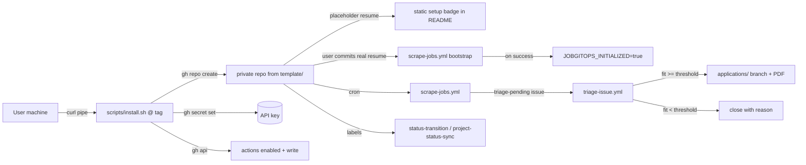

# JobGitOps Bootstrap Installer — Technical Specification

Status: **Aligned — all open items resolved; ready for implementation**
Author: Spec Agent session
Date: 2026-08-08

This spec defines a one-command `curl | sh` onboarding path for JobGitOps. Goal: a user creates a private job-search repository and starts receiving AI-triaged, tailored-resume job leads with zero manual configuration beyond adding one API key and dropping in their resume.

Resolved design decisions (from alignment session) — the five that frame the architecture:

- Template distribution: a `template/` **subtree** in this repo, materialized by `install.sh` (single source of truth, no drift).
- Template workflow scope: **runtime core only** (scrape, triage, respond, status-transition, project-status-sync, sync-labels); upstream shell updates via an optional manual script (§7.6).
- Repo visibility: **private by default**.
- Resume handling: install.sh ships a **placeholder** `resumes/resume.yaml`; the user replaces it later; the **first scrape fires once on the first real-resume commit**, later scrapes run via cron only.
- Readiness: the README ships a **static "setup required" badge**; the user removes it after their first successful run (a private repo cannot host a public dynamic badge).

All remaining decisions (LLM provider, `:latest` image tracking, fork-and-run fallback, badge copy, etc.) are recorded in the resolution log (§13).

---

## 1. Goal & Success Criteria

A new user completes setup with one command plus a few plain-English steps:

```bash
curl -fsSL https://raw.githubusercontent.com/menil/jobgitops/v1.0.0/scripts/install.sh | sh -s -- my-job-search
```

Then:

1. Edit `resumes/resume.yaml` in the new private repo (fill in their real resume).
2. Commit and push to `main`.
3. Done. One bootstrap scrape runs, the daily cron takes over, and triage/tailoring runs on the existing webhooks. Remove the static setup badge from the README.

**Success criteria:**

- S1. The one-liner completes end-to-end with no user file edits *before* it runs (secrets, permissions, settings handled by the script).
- S2. The README ships a prominent static "setup required — replace `resumes/resume.yaml`" badge that the user removes once their first scrape succeeds.
- S3. Exactly **one** bootstrap scrape runs on the first real-resume commit; later resume edits and `config/**` changes never trigger a scrape.
- S4. No spurious workflow runs while the resume is a placeholder.
- S5. Users get engine updates automatically (shared `:latest` image) and shell updates via an optional manual `sync-template.sh`, never re-forking.

---

## 2. Architecture



Two planes:

- **Engine plane** — everything that runs lives in the shared public image `ghcr.io/menil/jobgitops:latest` (Python package baked in). Users never build or host the engine.
- **Shell plane** — per-user, per-repo files: workflows, labels, settings, resume, templates. Produced by `template/` + `install.sh`; updated from upstream via the optional manual `sync-template.sh` (§7.6).

---

## 3. `template/` Subtree Layout

Single source of truth for a user repo, installed verbatim by `install.sh` (with settings interpolation).

```text
template/
├── .github/
│   ├── labels.yml                      # lifecycle labels (triage-pending, fit:*, applied, in-loop, rejected, ...)
│   └── workflows/
│       ├── scrape-jobs.yml             # cron + workflow_dispatch + one-time bootstrap trigger
│       ├── triage-issue.yml            # issue labeled triage-pending
│       ├── respond-issue.yml           # issue comment / issue opened
│       ├── status-transition.yml       # issue labeled applied/in-loop/rejected
│       ├── project-status-sync.yml     # Projects V2 item events (label-only if unconfigured)
│       └── sync-labels.yml             # push to main -> apply labels.yml
├── config/
│   └── settings.yaml                   # defaults; search.enabled: true; projects_v2 commented out
├── resumes/
│   ├── resume.yaml                     # PLACEHOLDER with sentinel (see §4)
│   ├── template.html                   # Jinja2 resume template (required by renderer)
│   └── style.css                       # PDF styling (required by renderer)
├── README.md                           # static setup badge + 3-line setup + docs link
└── .gitignore                          # minimal
```

**Deliberately absent:** `src/`, `tests/`, `specs/`, `AGENTS.md`, `.beads/`, `.githooks/`, `.idea/`, `devenv*`, `Justfile`, `Dockerfile`, `pyproject.toml`, `uv.lock`, and maintainer workflows (`build-runner.yml`, `ci.yml`, `pr-review.yml`). The user repo contains **no code** — the engine is in the image.

**Interpolation point** (done by `install.sh`, never committed to `template/`):

- *None.* `config/settings.yaml` ships with defaults; per-user options like `search.location` (default `Remote`) are documented in the README and edited directly in the config — same workflow as replacing the placeholder resume.

---

## 4. Placeholder Resume & Sentinel

`template/resumes/resume.yaml` ships as a **lean skeleton** whose first line is a unique sentinel comment. Only `basics.name` is mandatory under `jobgitops.schema`; the empty sections show the user where content goes and render cleanly (the HTML template guards every section):

```yaml
# __JOBGITOPS_SETUP_PENDING__   # sentinel
# Replace this placeholder with your real resume, then commit & push to main.
# It is a YAML file in JSON Resume format — see https://jsonresume.org/schema.
basics:
  name: "Your Name Here"
work: []
education: []
skills: []
projects: []
```

Rules:

- **Detection is parsing-free:** `grep -q '__JOBGITOPS_SETUP_PENDING__' resumes/resume.yaml`. A placeholder is "real" once the user overwrites the file (sentinel gone). No YAML parsing in shell steps.
- Every gated workflow (`scrape`, `triage`) checks the sentinel in its pre-job `check` step and **skips with a clear message** when present (S4).

---

## 5. `scripts/install.sh`

### 5.1 Usage

```bash
# Interactive
curl -fsSL https://raw.githubusercontent.com/menil/jobgitops/v1.0.0/scripts/install.sh | sh -s -- my-job-search

# Non-interactive
GEMINI_API_KEY=... sh install.sh my-job-search --yes --provider gemini
```

Served from `raw.githubusercontent.com/menil/jobgitops/<tag>/scripts/install.sh`. The pinned `<tag>` is the release tag (§8) — the URL *is* the version pin; no separate version bookkeeping.

### 5.2 Interface

| Input | Source | Default |
| --- | --- | --- |
| Repo name | positional `$1` | `job-search` (prompt default) |
| Visibility | `--visibility private\|public` | `private` |
| Provider | `--provider gemini\|openrouter` | auto: `gemini` if its key present, else `openrouter` |
| Gemini key | `--gemini-key` or `$GEMINI_API_KEY` | prompt if absent |
| OpenRouter key | `--openrouter-key` or `$OPENROUTER_API_KEY` | prompt if absent |
| Token (PAT fallback) | `--token` or `$GH_TOKEN` | `gh` auth |
| Non-interactive | `--yes` | prompts on |
| Simulation | `--dry-run` | off |

The `--token`/`$GH_TOKEN` PAT fallback is for environments where the GitHub CLI is installed but not `gh auth login`-configured (e.g. CI, ephemeral containers): every step that would call `gh` (create repo, set secrets, enable Actions) instead runs with that token. In a normal interactive install the user's existing `gh` auth is used and no token is needed.

### 5.3 Execution Steps (in order)

1. **Preflight** — verify `gh` is installed and authenticated (`gh auth status`) or a token was supplied; repo name is a valid slug. Fail fast with actionable messages.
2. **Permission check** — confirm the token can do everything the install needs *before* creating the repo: `gh api user` returns the `X-OAuth-Scopes` response header; require `repo` (create repo + set secrets) and `workflow` (enable Actions/write permissions). Missing scopes → exit with an actionable error naming the exact scopes to add (`gh auth refresh -s repo,workflow`). Any later step that still fails on permissions aborts with the command and exit code (§5.4).
3. **Fetch template** — resolve the latest release tag (`gh api repos/menil/jobgitops/releases/latest`), download its tarball from `codeload.github.com/menil/jobgitops/tar.gz/refs/tags/<tag>`, extract `template/` into a temp working dir. Trap-clean on exit.
4. **Assemble** — write `config/settings.yaml` from defaults (`projects_v2` commented out, `search.enabled: true`, `search.location: Remote` as the documented default, `custom_queries` empty so queries derive from the resume, `fit_threshold: 3.5`). Confirm placeholder resume is present and untouched.
5. **Create empty repo** — `gh repo create <name> --<visibility> --confirm` (no `--source` yet; we control push ordering).
6. **Set secrets** — `gh secret set GEMINI_API_KEY` / `OPENROUTER_API_KEY` for the chosen provider (read-hidden prompt; never echoed).
7. **Enable Actions + write permissions** — one API call with the user's admin token (the thing an in-repo workflow can never do):
   ```bash
   gh api --method PUT repos/<OWNER>/<REPO>/actions/permissions \
     -f enabled=true -f allowed_actions=all -f default_workflow_permissions=write
   ```
8. **Push** — `git init -b main`, add remote, commit assembled tree, push. First push triggers `sync-labels.yml`. No scrape is triggered (resume is placeholder).
9. **Summary** — print repo URL and the three next steps (edit `resumes/resume.yaml` → commit → push), noting the static setup badge to remove after the first run and the one-time bootstrap scrape.

**Ordering rationale:** the repo is created and configured *before* the first push, so no workflow ever runs against a repo lacking its secrets or write permissions.

### 5.4 Safety & Errors

- `--dry-run` prints every command it would run and exits without side effects.
- The script echoes each destructive command; any `gh` failure aborts with the command and exit code.
- Re-running against an existing repo name fails cleanly at create with a "use a different name" message.
- Secrets are never printed or written to disk beyond the `gh secret set` call.

---

## 6. Shared Runner Image

### 6.1 Package

- Published to **GHCR as a public package**: `ghcr.io/menil/jobgitops` (owner of this repo). Public pull is required so every user repo pulls without credentials; template workflows drop the `credentials:` block entirely.
- One-time visibility flip before the first release (see §8): `gh api --method POST /user/packages/container/jobgitops/visibility -f visibility=public`.

### 6.2 Dockerfile change

Today the image only installs dependencies (`uv sync --frozen --no-install-project`) and relies on `PYTHONPATH=$workspace/src`. For a self-contained engine, install the project into the image:

```dockerfile
RUN uv sync --frozen   # installs project + deps into /usr/local
```

This bakes `jobgitops` and its CLI entry points into the image so template workflows run `python -m jobgitops.cli.<cmd>` from any working directory — **no checkout of `src/`, no `uv sync`, no `PYTHONPATH`**.

### 6.3 Build triggers

`build-runner.yml` (existing mechanics, plus tags):

- `push` to `main` → build+push `:latest`.
- `tag vX.Y.Z` → build+push `:vX.Y.Z` **and** `:latest`.

Template workflows pin `image: ghcr.io/menil/jobgitops:latest` (S5).

---

## 7. Template Workflows

All runtime-core workflows differ from the repo's current dev workflows in three ways:

- `container.image: ghcr.io/menil/jobgitops:latest` — **no `credentials:` block**, no `RUNNER_IMAGE` variable.
- **No `uv sync` step, no `PYTHONPATH` env** — the image has the package baked in (§6.2).
- Added sentinel gating where noted.

### 7.1 scrape-jobs.yml

Triggers:

- `schedule` — daily cron.
- `workflow_dispatch` — manual, with existing inputs (location/job_type/hours_old/dry_run).
- `push` — `paths: ['resumes/resume.yaml']` — the **bootstrap trigger**.

`check` job gate (runs on the hosted runner, gated output `enabled`):

| Event | Runs if |
| --- | --- |
| `workflow_dispatch` | resume not placeholder |
| `schedule` | `search.enabled: true` AND resume not placeholder |
| `push` (resumes/resume.yaml) | `search.enabled: true` AND resume not placeholder AND `JOBGITOPS_INITIALIZED != true` |

The `scrape` job (`needs: check`) runs `python -m jobgitops.cli.scrape`. **On success only**, set the repo variable to make the bootstrap one-time:

```bash
# PATCH returns 404 if the variable doesn't exist yet; fall back to create.
gh api --method PATCH repos/${{ github.repository }}/actions/variables/JOBGITOPS_INITIALIZED \
  -f value=true \
  || gh api --method POST repos/${{ github.repository }}/actions/variables \
       -f name=JOBGITOPS_INITIALIZED -f value=true
```

(Requires `actions: write` in the workflow `permissions:` block.)

- If the bootstrap scrape fails, the variable stays unset → the next real-resume commit retries it (self-healing).
- If the variable cannot be set (permissions regression), the failure is logged and the bootstrap re-fires on the next resume push — acceptable degradation, never silently dropping jobs (S3).
- `config/**` changes never appear in the trigger paths (S3).

### 7.2 triage-issue.yml

- Trigger: issue labeled `triage-pending` (unchanged).
- Gate: if the sentinel is present, post a comment "Setup pending — update `resumes/resume.yaml` and push to `main`." and exit; the issue stays `triage-pending`. Prevents garbage triage before a real resume exists (S4).
- Otherwise: run `python -m jobgitops.cli.triage` unchanged.

### 7.3 respond-issue.yml

- Trigger: issue comment / issue opened (unchanged).
- No sentinel gate — the assistant answers questions regardless; a bare-URL auto-triage attempt still results in a `triage-pending` issue, which `triage-issue.yml` then gates.

### 7.4 status-transition.yml / project-status-sync.yml / sync-labels.yml

- Copy the current workflows verbatim, minus `uv sync`/`PYTHONPATH`/`credentials`, with `projects_v2` label-only behavior (board disabled until the user opts in).
- `sync-labels.yml` applies `.github/labels.yml` on every push to `main` (unchanged).

### 7.5 Static setup badge (no dynamic workflow)

Because the repo is private, a dynamic shields.io endpoint badge (which fetches the status JSON **server-side**) cannot read it — shields would render "invalid" forever. So the template ships a **static** badge instead:

```markdown

```

The badge lives in the README's "getting started" snippet and is **removed by the user once their first scrape succeeds** (S2). No workflow maintains it — nothing to keep in sync, nothing to loop.

The README's getting-started section also points to `config/settings.yaml` for per-user options (`search.location` defaults to `Remote`) — edited directly, same workflow as replacing the placeholder resume.

### 7.6 sync-template.sh (optional, manual) — upstream shell updates

No scheduled workflow: pulling `.github/` changes from upstream is a manual, user-initiated action. The optional script ships in this repo (next to `install.sh`) and is run against the user's repo:

```bash
curl -fsSL https://raw.githubusercontent.com/menil/jobgitops/vX.Y.Z/scripts/sync-template.sh \
  | sh -s -- <OWNER>/<REPO>
```

The script runs the steps once:

1. Resolve latest release tag: `gh api repos/menil/jobgitops/releases/latest` → tag.
2. Download that tag's tarball, extract **`.github/` only** (workflows + labels.yml).
3. Diff against the repo's local `.github/`. No diff → exit 0 silently.
4. Else: create/update branch `sync/upstream-template`, commit the `.github/` changes, open a PR (body lists changed files + link to the release). **Never auto-merges**; never touches `config/`, `resumes/`, `status/`, or `README.md`.

Requires `contents: write` and `pull-requests: write` scopes on the token used (a PAT, or `gh` auth + `--token`). Kept manual deliberately: workflow files are the one thing a user can't adjust in their config (bug fixes, label definitions, new triggers), but pulling them is a decision, not a background job.

---

## 8. Release Process

Documented in a short **`RELEASING.md`** at the repo root. Checklist:

1. **One-time (first release only):** flip the GHCR package to public: `gh api --method POST /user/packages/container/jobgitops/visibility -f visibility=public`.
2. Cut semver tag `vX.Y.Z` on `main`.
3. Tag push → `build-runner.yml` builds/pushes image `:vX.Y.Z` and `:latest` (§6.3).
4. The install URL for that release is `raw.githubusercontent.com/menil/jobgitops/vX.Y.Z/scripts/install.sh` — no separate bump step; the URL is the pin.
5. Optional: users run `scripts/sync-template.sh` manually to pull `.github/` diffs (§7.6); not automatic.
6. Verify: dry-run the installer, then a live install on a throwaway repo (static setup badge renders; exactly one bootstrap scrape; user removes the badge).

---

## 9. Security

- **curl | sh posture:** HTTPS + pinned tag URL; script echoes every command; `--dry-run`; no su/sudo; only `gh`/`git`/standard POSIX tools. README advises users to review the script before running (as with any pipe-from-curl installer).
- **Token hygiene:** the user's admin token is used transiently by `gh` only (never printed, never stored). API keys pass straight into `gh secret set`.
- **Repo secrets:** only the provider key is stored; nothing else sensitive lives in the user repo. The public image contains engine code only.
- **Sync trust boundary:** `sync-template.sh` opens PRs; a human merges. Engine changes ship via `:latest` and are exercised by the user's own cron.
- **Loop safety:** every new commit path is checked for self-retrigger (the bootstrap marks `JOBGITOPS_INITIALIZED` once; sync-template.sh writes to a branch). Preserve the existing `respond.py` bot guards.

---

## 10. Testing & Validation

- `shellcheck` on `scripts/install.sh`, wired into the existing `just validate` chain (add shellcheck to the devenv/Nix env and a `just` target).
- Any new Python module added for the bootstrap (e.g. sentinel check, settings generation) ships with pytest tests through the existing `just validate` 90% coverage gate; shell-only logic is validated by the E2E runbook.
- **Manual E2E runbook (documented):** run `install.sh --dry-run`; then live against a throwaway repo; verify the static setup badge renders, exactly one bootstrap scrape fires, cron-only thereafter, and a `sync-template.sh` PR can be produced. Capture the steps in the README or a `scripts/e2e.md`. [TODO for implementation]
- Existing pytest suite must remain green after the Dockerfile change (§6.2) and after the workflow migration (§12) — the repo's own `ci.yml` still exercises the image.
- Sentinel detection is exercised indirectly by the gating paths; no bats test framework for v1 (explicitly out of scope).

---

## 11. Non-Goals (v1)

- Markdown resume input (`resume.md`) — YAML/JSON Resume only.
- Non-CLI setup (web UI / "Use this template" click path).
- Projects V2 automated onboarding — label-only is the default; users opt into a board manually.
- Publishing the engine as a PyPI package or composite actions (possible later; image-baked CLI is v1).
- Windows installer support.
- GitHub App / marketplace distribution.

---

## 12. Migration of This Repo

1. Create `template/` by copying the runtime subset (§3) from current `.github/`, `config/`, `resumes/`.
2. Modify `Dockerfile` (§6.2) and `build-runner.yml` (§6.3).
3. Add `scripts/install.sh` (§5) and the optional `scripts/sync-template.sh` (§7.6).
4. **Dogfood:** migrate this repo's *own* workflows (scrape, triage, respond, status-transition, project-status-sync, sync-labels, ci) to the shared-image style — `image: ghcr.io/menil/jobgitops:latest`, drop `uv sync` / `PYTHONPATH` / `credentials` / the `RUNNER_IMAGE` variable. Accept the stale-by-minutes `:latest` race on `main` (benign; the cron validates the new image). Add shellcheck to `just validate`.
5. README: add the Quick Start one-liner; keep the existing fork-and-run section as "Advanced: self-hosted".
6. Add `RELEASING.md` (§8).

---

## 13. Resolution Log

All previously-open items are resolved:

| # | Item | Resolution |
| --- | --- | --- |
| 1 | Image path & install URL host | `ghcr.io/menil/jobgitops`; `raw.githubusercontent.com/menil/jobgitops/<tag>/scripts/install.sh` |
| 2 | Placeholder skeleton shape | Lean: sentinel + `basics.name` + empty `work/education/skills/projects` lists |
| 3 | Validation depth | shellcheck in `just validate` + manual E2E runbook; no bats |
| 4 | Dogfooding | Migrate this repo's own workflows to the shared-image style |
| 5 | Release docs | Dedicated `RELEASING.md` |
| 6 | Badge mechanism | Private repo + **static** "setup required" badge (no dynamic endpoint; removed by the user after first run) |
| 7 | GHCR visibility | One-time documented `gh api` command in `RELEASING.md` |
