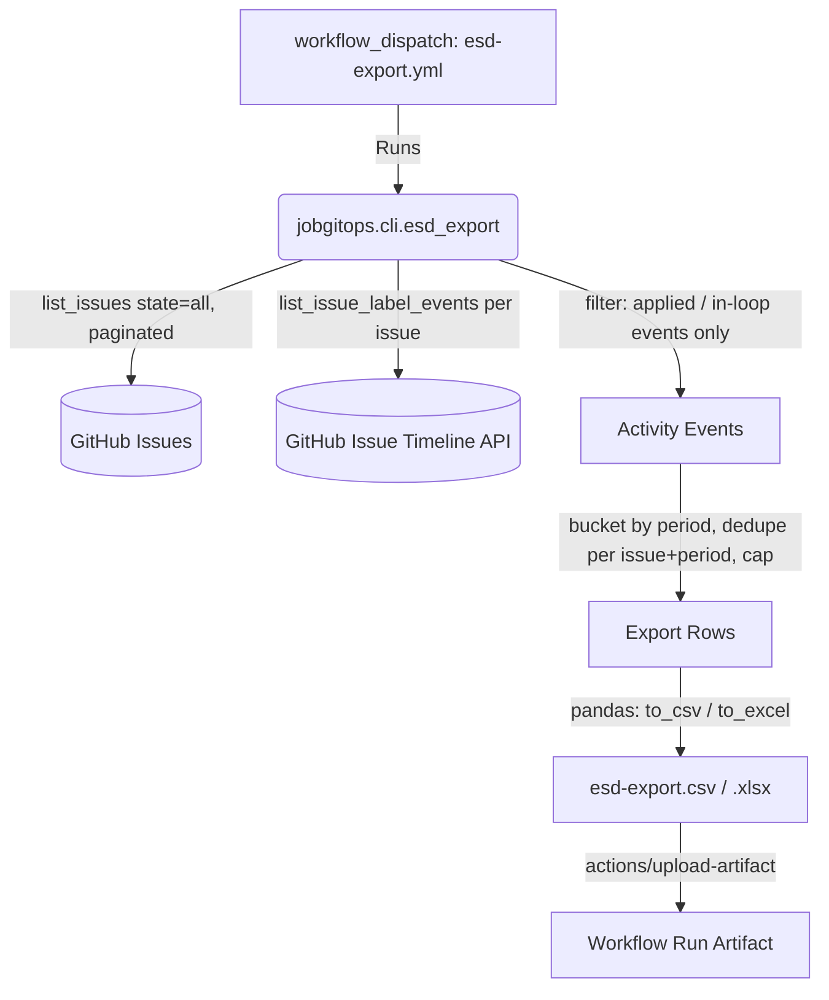

# JobGitOps ESD Export — Technical Specification

This document defines the design for a manually-triggered export of job-search
activity, formatted as a spreadsheet suitable for filing with a state or
national unemployment department (an "ESD" — Employment Security Department,
using Washington State's name for the agency as shorthand; the feature is not
tied to any one jurisdiction). It builds on the lifecycle label model in
`specs/spec.md` §2.3 and `src/jobgitops/status_model.py`.

> Status: **Resolved.** All open questions were settled in a planning session
> with the author; no `[TBD]` markers remain.

---

## 1. Overview

Most US states (and some other jurisdictions) require unemployment claimants
to log a minimum number of job-search activities per reporting period (often
weekly) and submit that log to the unemployment agency. JobGitOps already
tracks every application's lifecycle as GitHub issue labels
(`applied` → `in-loop` → `offer-received` / `rejected`); this feature turns
that label history into the kind of activity log those agencies expect,
without introducing any new persisted state.

A person runs the export on demand (from the GitHub Actions "Run workflow"
button) with a handful of parameters that account for how reporting rules
differ by jurisdiction — grouping period, week start day, output format, and
a per-period row cap — and downloads the resulting file as a workflow
artifact.

---

## 2. Goals & Non-Goals

### Goals

- Produce a CSV or XLSX file listing job-search activities, one row per
  distinct (issue, reporting period) pair, from the existing GitHub Issues
  label history — no new database, no new persisted log.
- Let the four axes jurisdictions actually differ on be parameters of a
  single run: grouping period (weekly/monthly), first day of the week,
  output format, and a maximum-rows-per-period cap.
- Only report activities the *claimant themselves performed* — submitting an
  application, participating in an interview — not outcomes an employer
  imposed on them (a rejection or an offer).
- Keep the job read-only against GitHub: it never writes labels, comments, or
  Projects V2 state. It only reads issues and their label-change history.

### Non-Goals

- Not a scheduled/recurring job. It runs only when a person explicitly
  triggers it (`workflow_dispatch`), since ESD filings happen on the agency's
  cadence, not JobGitOps's.
- Not a per-jurisdiction template engine. It does not know about any specific
  state's exact form fields (employer address, contact phone, etc.); it
  produces a generic activity log a claimant can transcribe from or attach as
  supporting evidence. A fully templated per-state form is out of scope
  unless a future revision adds it.
- Does not persist a new activity-history data store. All history is
  reconstructed at export time from GitHub's issue timeline API.

---

## 3. Architecture

No new GitHub Actions secrets are required beyond the `GITHUB_TOKEN`/`GH_PAT`
already used by every other JobGitOps workflow.

---

## 4. Activity Scope

An "activity" is a GitHub issue label transition the claimant caused by their
own action. Only two lifecycle labels qualify:

| Label      | Counts as an activity? | Rationale                                            |
|------------|:-----------------------:|-------------------------------------------------------|
| `applied`      | Yes | The claimant submitted an application.            |
| `in-loop`      | Yes | The claimant is participating in an interview process. |
| `rejected`     | No  | An outcome imposed by the employer, not an action the claimant took. |
| `offer-received` | No | Same — an employer-driven outcome, not a claimant action. |
| `triage-pending`, `ready-to-apply`, `triage-mismatched` | No | Pre-application / internal pipeline states never surfaced to the claimant as something they "did." |

This set is defined as `ACTIVITY_LABELS` in `src/jobgitops/status_model.py`,
next to the existing `LIFECYCLE_LABELS`, so it stays the single source of
truth alongside the rest of the label semantics.

---

## 5. History Reconstruction

JobGitOps does not currently persist *when* a label was added — only the
current label set. Rather than add a new write path to every place a
lifecycle label changes (`status_transition.py`, `project_sync.py`,
`respond.py`), the export job reconstructs history on demand from GitHub's
per-issue timeline API (`GET /repos/{owner}/{repo}/issues/{issue_number}/timeline`),
which retains every `labeled`/`unlabeled` event with a timestamp for the
life of the issue.

Trade-off accepted: an export run costs one timeline API call per issue in
scope (paginated), rather than being a cheap read of a small log file. This
was chosen over adding a persisted activity log because it requires no new
write-path changes to existing status-transition code and cannot drift from
GitHub's own record of what happened.

This is only viable because the job is manual and infrequent (§2 Non-Goals):
for a repo with hundreds of issues, that's hundreds of sequential HTTP
round-trips, likely a multi-minute run. `GitHubClient`'s existing retry/backoff
handling (`_retryable_status_codes`, honoring `Retry-After`) already covers
transient 429/5xx responses, so no new rate-limit handling is needed — but if
any fetch exhausts its retries and still fails, the job aborts without writing
an output file. A partial, silently-incomplete export is worse than a failed
run for a document someone is about to file with a government agency, so
there is no partial-success path: either every fetch in scope succeeds and
the full file is written and uploaded, or none of it is.

`GitHubClient.list_issue_label_events(issue_number)` (new method) returns the
raw `labeled`/`unlabeled` timeline events for one issue; filtering to the
`ACTIVITY_LABELS` subset and to `labeled` events specifically happens in the
export pipeline, not the client.

---

## 6. Component Specification

### 6.1. Export Pipeline — `src/jobgitops/esd_export.py`

1. Fetch every issue (`state="all"`), paginating fully — this export needs
   complete history, unlike the scraper's last-100-issues dedup cache.
2. For each issue, fetch label events via
   `GitHubClient.list_issue_label_events` and keep only `labeled` events
   whose label is in `ACTIVITY_LABELS`.
3. Filter events to the `[start_date, end_date]` window (`start_date`
   optional/unbounded, `end_date` defaults to today).
4. Bucket each qualifying event into a period key using the UTC calendar date
   of its `created_at` timestamp (GitHub timeline timestamps are UTC; no
   timezone conversion is performed, so a period boundary is always a UTC
   midnight):
   - `monthly`: the event's `(year, month)`.
   - `weekly`: the most recent date on or before the event that falls on the
     configured `week_start` weekday.
5. Group by `(issue_number, period_key)` and collapse each group to one row
   using the *most recent* qualifying event in that group (an issue that
   moved from `applied` to `in-loop` within the same period reports the
   `in-loop` activity for that period; the `applied` activity, if it fell
   in an earlier period, still has its own row there).
6. Within each period, sort surviving rows by event date ascending; if
   `max_per_period` is not `unlimited` and the period exceeds it, keep only
   the chronologically earliest `max_per_period` rows.

   Steps 5 and 6 deliberately use opposite orderings, and that's
   intentional, not an inconsistency: dedupe (step 5) always keeps an
   issue's *latest* stage in a period, since that's the truest snapshot of
   what happened; the cap (step 6) always keeps the *earliest* rows, since a
   claimant filing a capped weekly log wants to show they didn't wait until
   the last day to act. Two issues with an identical event timestamp break
   ties by issue number (ascending) for determinism.
7. Resolve `company`, `role`, and `apply_url` for each surviving row via the
   existing `parse_job_details(body, title)` (`src/jobgitops/cli/triage.py`)
   — reused as-is, not reimplemented (`role` populates the `Position`
   column; see §7). This reads the issue's *current* body/title, not a
   point-in-time snapshot — if a job posting's title or company text is
   edited after the activity happened, the export reflects the edited
   version. Accepted as a known limitation: issue titles/bodies are edited
   rarely enough in practice that a point-in-time snapshot isn't worth the
   added complexity. `parse_job_details`'s `source` field (which job board
   the *listing* was scraped from) is deliberately never surfaced in the
   export — see §7's `Activity` text rules for why.
8. Format a `Period` label for each surviving row from its period's start
   date: `"YYYY-MM"` for monthly, or the ISO 8601 week (`"YYYY-Www"`)
   containing that start date for weekly. When `week_start=monday`, weekly
   periods coincide exactly with real ISO weeks; for any other
   `week_start`, the custom period can span two ISO week numbers, so the
   label reflects the week the period *starts* in, not necessarily every
   day inside it — documented behavior, not a bug.

### 6.2. Spreadsheet Writer

Given the final row list and a `format` (`csv`/`xlsx`), writes the output
file via `pandas.DataFrame.to_csv()` / `.to_excel(engine="openpyxl")` — no
hand-rolled CSV/XLSX serialization. `openpyxl` is a **new** dependency (added
to `pyproject.toml`); `pandas` itself does not vendor an XLSX write engine.

### 6.3. CLI — `src/jobgitops/cli/esd_export.py`

Entry point `jobgitops-esd-export`, registered in `pyproject.toml`
`[project.scripts]`. Flags: `--group-by {weekly,monthly}`,
`--week-start {monday..sunday}` (default `monday`), `--format {csv,xlsx}`,
`--max-per-period <int|unlimited>` (default `unlimited`), `--start-date`,
`--end-date`, `--output PATH`.

### 6.4. Workflow — `template/.github/workflows/esd-export.yml`

`workflow_dispatch`-only (no `schedule:`), with one input per CLI flag above.
Runs the CLI, then uploads the produced file via `actions/upload-artifact`
(default retention; the artifact contains company/position/activity data, not
raw PII, so no shortened retention override is needed). Declares an explicit
least-privilege `permissions:` block (`issues: read`, `contents: read`) since
this job never writes anything — narrower than the default token scope other
JobGitOps workflows need for their label/comment/Projects V2 writes. No
Projects V2 badge-update steps: those track the recurring background jobs'
health (used by `scrape-jobs.yml` and `gmail-sync.yml`, both schedule-
triggered); an on-demand, manually-triggered export isn't part of that
status dashboard.

---

## 7. Data Contract: Export Row Schema

Each row has exactly these columns, in this order:

| Column          | Source | Notes |
|-----------------|--------|-------|
| `Period`        | The row's reporting period, formatted per §6.1 step 8 | First column, so periods are visually scannable/groupable in the spreadsheet. |
| `Date`          | Winning event's `created_at`, formatted `YYYY-MM-DD` (`.isoformat()`) | |
| `Company`       | `parse_job_details().company` | |
| `Position`      | `parse_job_details().role` | |
| `Activity`      | Free-text sentence, not a fixed code (see below) | |
| `Application URL` | `parse_job_details().apply_url`, only for `applied` rows | Blank for `in-loop` rows — an interview activity isn't "the application URL." |

`Activity` text:

- `applied` row: `"Applied online"`, always — never `"via {source}"`.
  `parse_job_details().source` only records which job board the *listing*
  was scraped from (LinkedIn, Indeed, ...), not how the claimant actually
  submitted the application, which is frequently a different channel (e.g.
  the company's own careers site reached by clicking through). Naming a
  specific application channel would overclaim in a document filed with a
  government agency, so `source` is never surfaced in the export at all.
- `in-loop` row: `"Interview scheduled"` — not `"Interviewed for position"`.
  The `in-loop` label means an interview was scheduled with the claimant,
  not that one has necessarily happened yet by the time of export; this
  wording states the ongoing status without asserting a specific completed
  interview. Determining the label change's real trigger (e.g. by reading
  issue comments with an LLM) was considered and rejected: real per-row
  cost/latency for a manually-triggered export that should stay simple and
  deterministic.

No issue-number or internal-ID column — not meaningful to an ESD caseworker
reviewing the filing.

---

## 8. Configuration (Workflow Inputs)

| Input | Type | Default | Meaning |
|-------|------|---------|---------|
| `group_by` | choice: `weekly`, `monthly` | *(required)* | Reporting period granularity. |
| `week_start` | choice: `monday`..`sunday` | `monday` | First day of the week; ignored when `group_by=monthly`. |
| `format` | choice: `csv`, `xlsx` | *(required)* | Output spreadsheet format. |
| `max_per_period` | string (int or `unlimited`) | `unlimited` | Row cap per period; jurisdictions that only accept e.g. 3 activities/week set `3` here. |
| `start_date` | string, `YYYY-MM-DD` | unset (full history) | Optional lower bound. |
| `end_date` | string, `YYYY-MM-DD` | unset (today) | Optional upper bound. |

These are not stored in `config/settings.yaml` — they're per-run
`workflow_dispatch` inputs, since what a claimant needs to file typically
varies run to run (this week's log vs. a full quarter's backfill), unlike
the scraper/triage settings that are stable repo-wide configuration.

`start_date`/`end_date` that fail to parse as `YYYY-MM-DD`, or where
`start_date` is after `end_date`, are rejected by the CLI (§6.3) with a
clear error before any GitHub API calls are made — same fail-fast principle
as the `week_start`/`max_per_period` validation already called out there.

---

## 9. Testing

- `GitHubClient.list_issue_label_events`: mocked-HTTP unit tests, paginated
  and non-paginated cases.
- Pipeline (`esd_export.py`): activity-label filtering; weekly bucketing with
  a non-Monday `week_start`, including an event that lands exactly on the
  `week_start` weekday and a week spanning a month/year boundary; monthly
  bucketing; cap truncation (earliest-N kept) and its interaction with dedupe
  (cap always applies to already-deduped rows, never to raw events);
  timestamp-tie-break determinism (issue-number ascending); date-range
  filtering, including boundary inclusivity (an event exactly on `start_date`
  or `end_date` is included) and an event timestamped "today" when `end_date`
  defaults; issues with zero `ACTIVITY_LABELS` events contribute zero rows;
  the `Period` label format for weekly (including the non-Monday
  `week_start` case where it reflects the ISO week the period starts in)
  and monthly grouping; and the `Activity`/`Application URL` text rules
  (`source` never appears in `Activity`, applied vs. in-loop wording).
  Dedupe gets its own named test for the specific
  cross-period scenario in §6.1 step 5 (an issue moving `applied` → `in-loop`
  within one period, with an earlier-period `applied` row surviving
  separately) — this is the trickiest case and the most likely to hide a
  correctness bug in a compliance-adjacent export, so it isn't left to be
  only incidentally covered by other cases.
- Writer: CSV/XLSX round-trip correctness (read back and compare), including
  that a blank `Application URL` survives round-trip as an empty string, not
  a `NaN`-derived string (`AGENTS.md`'s Pandas sanitization convention).
  Empty input produces a valid, headered, empty file rather than erroring.
- CLI: argument validation (rejecting an out-of-enum `--week-start`, a
  non-positive `--max-per-period` that isn't `unlimited`) and an end-to-end
  run against a mocked `GitHubClient`.
- All new code maintains the repo-wide 90% coverage threshold enforced by
  `just validate`.

---

## 10. Documentation Updates

- `specs/spec.md` §2 gains a one-line pointer to this document, matching the
  existing pointers to `specs/assistant-agent.md` and
  `specs/gmail-integration.md`.
- `README.md` or `DEVELOPMENT.md` (wherever `scrape-jobs.yml`'s manual-dispatch
  usage is documented, per `specs/spec.md` §4.1) gains a short section on
  running the export from the Actions tab and what each input means.
