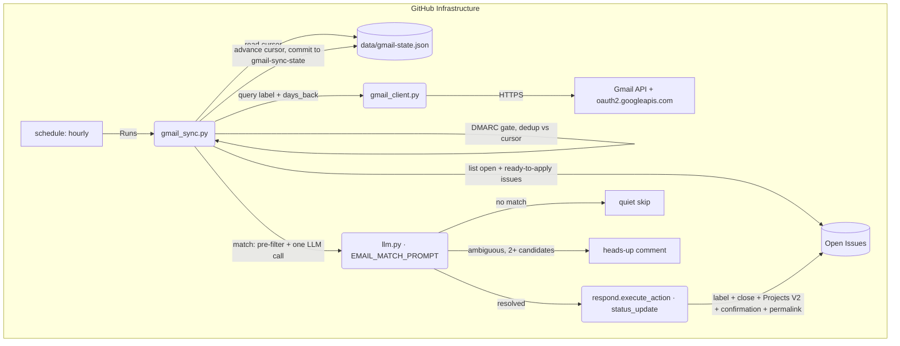

# JobGitOps Gmail Integration — Technical Specification

This document defines the architecture, data contracts, and workflows for an
**optional Gmail integration** that reads a user-filtered slice of their inbox,
detects application-lifecycle signals (interview invites, rejections, offers)
in ATS/recruiter email, matches each signal to the correct open job-issue, and
applies the same status-update side effects the conversational Issue Assistant
already performs from comments. It builds on — and reuses the core of — the
scraper/triage/Projects V2 machinery in `specs/spec.md` and the agent/action
architecture in `specs/assistant-agent.md`.

> Status: **Draft for review.** Design questions resolved with the author
> across multiple review rounds; no `[TBD]` markers remain (see §13 for the
> resolution log).

---

## 1. Overview

Today, moving an issue's status (`applied` → `in-loop` → `offer-received` /
`rejected`) requires the human to either hand-apply a label or type a
conversational intent as an issue comment ("I applied", "they rejected me").
Most of that signal, however, already arrives automatically as email from the
company's ATS (Greenhouse, Lever, Workday, etc.) or a human recruiter. This
feature closes that loop:

- The user tags relevant mail with a **Gmail label** they control (e.g.
  `JobGitOps`) — the integration only ever reads mail carrying that label.
- A new hourly GitHub Actions cron polls Gmail for label-tagged mail from the
  last `days_back` days that hasn't been processed yet.
- Each authentic (DMARC-verified) email is matched against the repo's open,
  actively-pursued issues and resolved to a status change via a single LLM
  call (§6), and a resolved match is executed through the **existing**
  `respond.py` `execute_action` side-effect path — the same code a
  conversational "they rejected me" comment triggers today. No new
  side-effect logic is introduced.

The feature is **off by default** and fully opt-in: it requires a repo owner
to explicitly enable it in `config/settings.yaml`, create a Gmail label and
filter, and provision three new secrets from a one-time manual OAuth setup.
A repo that never opts in is completely unaffected — the new workflow ships
in every synced template but exits in well under a second when the config
section is absent.

---

## 2. Goals & Non-Goals

### Goals

- Detect application-lifecycle status changes from a **user-filtered** slice
  of Gmail and apply them through the existing status-update side-effect path
  — no new label taxonomy, no new Projects V2 columns.
- Scope what the integration ever reads to a single Gmail label the user
  controls, and never invoke any other Gmail query shape — see §9.1 for the
  precise boundary this does (and does not) guarantee.
- Resolve "which issue does this email belong to" with a single LLM call per
  email, using a cheap deterministic pre-filter (§6.1) to narrow the
  candidate list handed to that call — not a separate auto-resolving branch.
- Stay within the free-by-default distribution model: no new package
  dependencies at all for the Gmail API calls (§5.1 — `google-api-python-
  client` and `google-auth` are already fully resolved via the existing
  `google-generativeai` dependency), and minimal added LLM spend — a
  narrowed candidate list keeps most calls cheap.
- Fail closed on spoofed/unauthenticated mail (DMARC) and never surface raw
  email content (which can carry personalized, tokenized ATS links) into a
  GitHub issue thread.
- Keep the integration fully optional and backward compatible: repos that
  don't opt in see no behavior change after a template sync.

### Non-Goals

- Not a job-lead discovery tool: this feature never creates new issues from
  email. It only updates issues that already exist and are open.
- Not real-time. Email is picked up on the next hourly poll; no Pub/Sub push
  subscription, no standing webhook receiver outside GitHub Actions.
- No two-way sync: the integration never sends, replies to, or modifies email.
  Gmail access is read-only (`gmail.readonly` OAuth scope).
- No support for multiple Gmail accounts per repo; one repo is one candidate's
  job search, so one Gmail account (matching the existing single-user model).
- Does not replace or change the conversational Issue Assistant's comment-based
  status-update flow (`specs/assistant-agent.md` §6–7); it is a second,
  independent trigger source for the same `status_update` action.

---

## 3. Architecture



Two new Python modules, one new workflow, and one config addition. No
existing module's *behavior* changes — the integration only calls into
`respond.execute_action` as a consumer.

| Artifact | Role |
| --- | --- |
| `src/jobgitops/gmail_client.py` | Thin wrapper over `googleapiclient.discovery.build('gmail', 'v1', ...)` (`google-api-python-client` + `google-auth`, already fully resolved via `google-generativeai`'s dependency tree — zero new packages): label-scoped message query, message fetch, DMARC check, MIME body extraction (§5.1, §13.7). |
| `src/jobgitops/cli/gmail_sync.py` | New CLI entry point / workflow handler: orchestrates cursor load → fetch → match → execute → cursor commit. |
| `src/jobgitops/assistant.py` (reused) | `AgentAction`, `ACTION_STATUS_UPDATE`, `ACTION_SKIP`, `VALID_STATUSES`, `STATUS_LABELS` are reused as-is; no new action type. |
| `src/jobgitops/cli/respond.py` (extended) | `execute_action` is called directly by `gmail_sync.py` for the `status_update` case, unchanged. Its bot-loop guard is extended (§9.7) to recognize a second hidden marker. |
| `src/jobgitops/schema.py` (extended) | New `GmailConfig` dataclass, optional `Settings.gmail` field. |
| `template/.github/workflows/gmail-sync.yml` (new) | Hourly cron + `workflow_dispatch`. |

---

## 4. Event & Workflow Design

### 4.1. `gmail-sync.yml` (new)

**Triggers:**

```yaml
on:
  schedule:
    - cron: "0 * * * *"   # hourly
  workflow_dispatch: {}
```

Hourly was chosen over 15-minute polling specifically to respect the GitHub
Actions free-tier minutes budget (personal accounts: 2,000 min/month), given
job-search repos are typically private and already run a daily scraper plus
on-demand triage/respond workflows. Over 4–6 hours was rejected because a
rejection or interview-invite email sitting unnoticed for hours would
undercut the point of automating status tracking.

**Timeout & processing cap:** `timeout-minutes: 15` (matching
`respond-issue.yml`'s precedent), and `gmail_sync.py` processes at most
`MAX_MESSAGES_PER_RUN = 50` messages per invocation, oldest first. Any
remainder is simply left unprocessed — since none of it has been added to
the cursor yet, it's picked up automatically by the next hourly run. This
bounds worst-case runtime for a backlog burst (first-time opt-in with
pre-existing labeled mail, or a long gap since the last successful run)
instead of letting one run grow unbounded.

**Permissions:** `contents: write` (commits the cursor file), `issues: write`
(labels, comments, close).

**Concurrency:** `concurrency: { group: gmail-sync, cancel-in-progress: false }`
— a single global group (not per-issue, unlike `respond-issue.yml`) since one
run can touch multiple issues; overlapping runs must queue, not race, on the
shared cursor file.

**Job body:**

1. Checkout.
2. Set Badge (Running) — `update_badge.py "Gmail Sync" "running" "yellow"
   "gmail-sync-status.json"`, mirroring the badge convention every other
   template workflow already follows (`respond-issue.yml`, `scrape-jobs.yml`,
   etc.) — flagged as missing in review; every documented failure mode below
   (fatal config error, quota exit, cursor-push failure) was otherwise only
   visible by opening the Actions tab.
3. `python -m jobgitops.cli.gmail_sync`.
4. The script's **first action** is to load `config/settings.yaml` and check
   `settings.gmail`:
   - **Absent, or `enabled: false`:** log one line and exit `0` immediately.
     This is what makes the feature safe to ship in every synced template —
     a repo that hasn't opted in pays a fraction of a second per hour and
     nothing else.
   - **`enabled: true` but any of `GMAIL_CLIENT_ID` / `GMAIL_CLIENT_SECRET` /
     `GMAIL_REFRESH_TOKEN` missing:** this is a **fatal configuration error**
     (exit `1`, workflow shows red in the Actions tab) — the same treatment
     as a missing LLM key today (see README Troubleshooting). Opting in
     implies the manual OAuth setup (§8) was supposed to happen; silently
     no-op-ing here would hide a broken setup instead of surfacing it.
5. Update Badge (Passed/Failed), mirroring the same pattern.

**Environment:** `GITHUB_TOKEN` (`secrets.GH_PAT || secrets.GITHUB_TOKEN`),
`GITHUB_REPOSITORY`, the existing LLM provider secrets/vars
(`GEMINI_API_KEY`/`OPENROUTER_API_KEY`/`CLAUDE_CODE_OAUTH_TOKEN`,
`LLM_PROVIDER`, `*_MODEL`), plus the three new Gmail secrets (§8.2), plus
`GIST_ID`/`GH_PAT` for the badge update (already used by every other
workflow's badge step).

### 4.2. Interaction with existing workflows

No existing trigger, label set, or Projects V2 column changes. The cursor
commit (§7) is pushed to a dedicated orphan branch (`gmail-sync-state`),
never to `main` — so it can never spuriously re-trigger `check-setup.yml` or
`sync-labels.yml` (both listen on unfiltered `push: { branches: [main] }`;
`format-resume.yml` is already path-filtered to `resumes/resume.yaml` and
was never at risk either way). This also matches the existing precedent that
automated writes never land on `main`: tailored-resume changes already live
on dedicated `applications/<company>-<role>-<hash>` branches, not `main`.

**Loop-safety with `respond-issue.yml`:** the heads-up comment (§6.2) is
deliberately unmarked as a status update, but it's still an automated
comment posted with a real-user-like token — with nothing to distinguish it
from a genuine human comment, it would otherwise satisfy `respond-issue.yml`'s
`issue_comment` trigger and get treated as a fresh request by the
conversational assistant. §9.7 covers the fix: a second hidden marker,
recognized by an extension to `respond.py`'s existing bot-loop guard.

---

## 5. Component Specifications

### 5.1. `src/jobgitops/gmail_client.py` — Gmail client (new)

**Module choice (§13.8):** uses the official `google-api-python-client`
(`googleapiclient.discovery.build`) together with `google-auth`
(`google.oauth2.credentials.Credentials`) for every Gmail call, rather than
hand-rolled `urllib.request`. Verified against `uv.lock`, not assumed: both
packages (and their own transitive dependencies `google-auth-httplib2`,
`httplib2`, `uritemplate`) are **already fully resolved today** as a direct
dependency of the existing `google-generativeai` package, so this adds zero
new packages to the container image. `google-api-python-client` is Google's
decade-old, actively-maintained general-purpose API client — unrelated to,
and not at similar risk as, the `google-generativeai` SDK deprecation
already tracked in `specs/assistant-agent.md` §13.4. That said, the
"zero new dependencies" property is contingent on `google-generativeai`
continuing to depend on these two packages transitively; if a future
`google-genai` migration (per that same follow-up) drops that transitive
path, `google-api-python-client`/`google-auth` become independent direct
dependencies at that point and should be given explicit version constraints
then, which they don't have today (matching the existing unpinned style of
`google-generativeai` itself).

The client library handles token refresh transparently (lazily, on first
request needing a valid token — no manual refresh call in our code at all),
pagination (`list_next()`), and retries (`.execute(num_retries=N)`)
natively. Only two hosts are ever contacted: `oauth2.googleapis.com` and
`gmail.googleapis.com` — `google-api-python-client` v2+ bundles static
discovery documents for well-known APIs including Gmail, so `build()` makes
no runtime call to a third host for the discovery document either (confirm
against the exact pinned version during implementation).

```python
class GmailClient:
    def __init__(self, client_id: str, client_secret: str, refresh_token: str):
        """Builds a google.oauth2.credentials.Credentials from the three
        secrets (token_uri="https://oauth2.googleapis.com/token") and a
        googleapiclient.discovery.build('gmail', 'v1', credentials=creds)
        service object. invalid_grant (revoked/expired refresh token)
        surfaces as a fatal config error, not a silent skip.
        """

    def resolve_label_id(self, label_name: str) -> str | None:
        """service.users().labels().list(userId="me").execute(); case-sensitive
        exact match on the user-configured label."""

    def list_message_ids(
        self, label_id: str, query: str | None, days_back: int
    ) -> list[str]:
        """service.users().messages().list(userId="me",
        q='label:"{label}" newer_than:{days_back}d [{query}]').execute(),
        paginated via list_next(). The single fetch path (§13.8): every run
        re-queries this same window, deduplicating against the cursor
        (§5.2, §7) rather than tracking an incremental sync cursor.
        """

    def get_message(self, message_id: str) -> Message:
        """service.users().messages().get(userId="me", id=message_id,
        format="full").execute() — a single call per message. format="full"
        already includes payload.headers, so this covers both the DMARC/
        header check and the body; a separate format="metadata" pre-fetch
        (as an earlier draft had) is redundant once the body is needed
        anyway, and doubles Gmail round-trips for no benefit.

        Returns Message(message_id, date, subject, sender,
        raw_auth_results: list[str], body_text). Prefers the text/plain
        MIME part for body_text; falls back to stripping tags +
        html.unescape on text/html. raw_auth_results preserves every
        Authentication-Results header instance verbatim (a message can
        carry more than one — see is_authentic, §5.1.2) rather than
        collapsing them into a dict that could silently pick the wrong one.
        """
```

#### 5.1.1. `query` narrowing now applies uniformly

`settings.gmail.query`, when set, is appended to every `list_message_ids`
call — since there is now only one fetch path (§13.8), the earlier
fallback-path-only limitation (an artifact of `historyId`'s scoping) no
longer applies. The label remains the actual boundary (§9.1); `query` is
still just a convenience for further narrowing an already-small labeled set.

#### 5.1.2. DMARC check (fail-closed, pinned to Gmail's own trust boundary)

```python
def is_authentic(
    raw_auth_results: list[str], trusted_authserv_id: str = "mx.google.com"
) -> bool:
    """True only if the Authentication-Results header instance whose
    authserv-id matches trusted_authserv_id reports dmarc=pass.

    Authentication-Results (RFC 8601) is hop-by-hop and not authenticated by
    default: a message can carry more than one such header (an earlier relay
    can stamp its own before final delivery), and only the instance added by
    Gmail's own trusted receiving MTA is meaningful. Naively substring-
    searching any header instance for "dmarc=pass" — the earlier draft's
    approach — would accept a header an upstream hop or the sender forged
    before Gmail ever saw the message. This function instead selects the one
    instance whose authserv-id identifies Gmail's own boundary and requires
    dmarc=pass specifically there; zero or multiple ambiguous matches on
    that authserv-id fail closed (return False).
    """
```

Any email failing this check is marked processed (added to the cursor) and
otherwise ignored entirely — no LLM call, no comment, not even a log line
beyond a debug-level note. This fail-closed gate (§13.1) prevents a forged
"you've been rejected" email from a spoofed sender domain from auto-closing
a real, live application.

Note the residual limit of DMARC as a control: it authenticates the
**sending domain**, not the free-text `From` display name, which is
attacker-controlled even on a domain with valid SPF/DKIM/DMARC. §6.1/§6.2
describe how the matching design keeps this from translating into a
no-review auto-resolution.

#### 5.1.3. Gmail permalink for issue comments

```python
def build_gmail_permalink(message_id: str) -> str:
    """https://mail.google.com/mail/u/0/#all/{message_id}"""
```

Every comment `gmail_sync.py` posts (§6.3, and the heads-up comment) links
back to the original message so the account owner can open it directly
rather than relying solely on the LLM's necessarily-lossy `summary`. The
`#all/` fragment resolves the message regardless of which label it's filed
under. The `u/0` account-index segment assumes the browser's primary
signed-in Google account is the one that owns the integration;
`DEVELOPMENT.md` notes this as a caveat for anyone using a secondary account
index. Unlike quoting the email body or an ATS's tokenized link (§9.4), this
link only resolves for someone already signed into that specific Gmail
account — it exposes no content to anyone else, so it's appended
unconditionally.

### 5.2. `src/jobgitops/cli/gmail_sync.py` — orchestrator (new)

Mirrors the structure of `respond.py` / `triage.py`.

1. Load `config/settings.yaml`, resolve `settings.gmail` (exit early per §4.1
   if absent/disabled; fatal-error per §4.1 if enabled with missing secrets).
2. Load the cursor from `data/gmail-state.json` (§7): `processed` (a
   `{message_id: date}` map) and `last_synced_at`. If `last_synced_at` is
   more than `days_back` days old (or absent on a first run, treated as
   "unknown, assume stale"), log a `::warning::` Actions annotation — mail
   older than `days_back` from now can no longer be recovered by this run's
   query, so a gap this large means something may have been missed (§13.8).
3. Resolve the Gmail label to a `labelId` (`GmailClient.resolve_label_id`);
   fatal error if the configured label doesn't exist in the account (a
   configuration mistake worth surfacing loudly, not silently skipping).
4. `list_message_ids(label_id, query, days_back)`, filter out IDs already in
   `processed`, cap the remainder to `MAX_MESSAGES_PER_RUN` (oldest first,
   §4.1).
5. For each remaining message ID:
   a. `get_message(message_id)` → `is_authentic` gate (§5.1.2). Fail →
      record `processed[message_id] = message.date`, continue.
   b. Run the match (§6): the deterministic pre-filter (§6.1) narrows the
      candidate pool (§5.3), then the single `EMAIL_MATCH_PROMPT` call
      (§6.2) resolves `{issue_number, status, summary}` against exactly that
      narrowed list — never a separately recomputed candidate set, which is
      what caused the two-phase design's coherence bug in an earlier draft
      (§13.8).
   c. On `status: null` (real mail, not a lifecycle signal): record
      processed, continue, no comment.
   d. On `issue_number: null` where the pre-filter tier was **zero-hit**
      (full pool passed, model found nothing in it either) or **one-hit**
      (the model rejected the pre-filter's only guess): quiet skip — record
      processed, continue, no comment, no issue creation (§2 non-goal). This
      applies regardless of how large the full candidate pool was in the
      zero-hit case — passing the whole pool to the model because the
      pre-filter found no signal is not itself evidence of ambiguity, so it
      must never trigger step (e).
   e. On `issue_number: null` where the pre-filter tier was **multi-hit**
      (2+ candidates matched a URL/domain or company-string signal, §6.1):
      **heads-up comment**, not silence — post a short, marked (§9.7)
      comment on **each** of those narrowed candidates, along the lines of
      "Detected a possible status update from [this email](<Gmail
      permalink>): (summary) — but couldn't confidently tell which
      application it belongs to. Please check and update the label manually
      if this is about this role." No label/status/Projects V2 change is
      applied. Record processed, continue.
   f. On a resolved `issue_number`: check whether a comment containing this
      message's Gmail permalink already exists on that issue
      (`gh_client.list_comments`, already used elsewhere in `respond.py`) —
      an idempotency guard for the at-least-once processing case in step 7.
      If found, skip (already handled by an earlier, not-yet-committed run);
      record processed, continue. Otherwise build an `AgentAction(action=
      ACTION_STATUS_UPDATE, status=status, reply=summary + gmail permalink)`
      and call `respond.execute_action(...)` with the matched issue's
      number/title/body/node_id, the loaded `settings`/`resume`, the shared
      `llm_client`, and `web_client=None` (the `status_update` branch of
      `execute_action` never touches `web_client`). Record processed.
6. Prune `processed`: drop any entry whose date is older than
   `days_back + 1` days — a message that old will never be returned by
   step 4's query again, so it's provably safe to forget (§13.8). This
   replaces a fixed-size ring buffer: storage tracks actual mailbox volume
   within the window rather than an arbitrary count, and never evicts
   something still in scope.
7. Commit the advanced cursor (`processed`, updated `last_synced_at`) to the
   dedicated `gmail-sync-state` orphan branch (§7). `git fetch origin
   gmail-sync-state` first; if the branch exists remotely, check it out and
   commit on top of it — if this is genuinely the first run ever, `git
   checkout --orphan` creates it. This fetch step matters: the analogous
   existing helper (`git_ops.py`'s `create_or_checkout_branch`) only checks
   *local* refs, which would treat every run on a fresh Actions runner as a
   first run and silently discard the cursor every single time (§13.8) — a
   real bug in an earlier draft that never specified this. On push failure,
   fetch again, rebase the local commit onto the now-current remote branch,
   and retry once (an ordinary non-force retry — this branch is never
   amended or force-pushed, so `git_ops.py`'s `_push_with_lease_retry`,
   which exists for the force-push/amend case on `applications/*` branches,
   doesn't apply here and an earlier draft mis-cited it). A hard failure
   here is logged but does **not** roll back the issue-side effects already
   applied — those are covered by step 5f's dedup check on replay.

### 5.3. Candidate pool: open, actively-pursued issues (`ready-to-apply` included)

`gh_client.list_issues(state="open")`, paginated the same way `triage.py`
and `scraper.py` already page GitHub issue listings (loop on `page` with
`per_page=100` until an empty page returns — an earlier draft asserted this
was "paginated" while describing "a single unfiltered fetch," which would
silently drop candidates past the first 100 for a repo with a large open-
issue count; §13.8). Filtered client-side to issues carrying one of
`{"ready-to-apply", "applied", "in-loop", "offer-received"}`
(`status_model.LIFECYCLE_LABELS` minus `triage-pending`) via
`extract_label_names`.

`ready-to-apply` is deliberately **included**: the most common
lifecycle-changing email of all is the ATS's own **application-confirmation**
email ("Thanks for applying to Acme Corp"), which arrives the moment the
user actually submits — i.e. exactly when the matching issue is still
sitting in `ready-to-apply`, not yet `applied`. That confirmation email is
precisely the signal that should drive the `ready-to-apply` → `applied`
transition.

Two deliberate scoping decisions remain:

- **`triage-pending` stays excluded:** a listing still awaiting AI triage has
  no application, submitted or otherwise, behind it — no email can plausibly
  reference it yet, so including it would only ever produce false matches.
- **Server-side label filtering is not used** for the OR-across-four-labels
  case: GitHub's `issues?labels=` query parameter is an **AND** filter across
  the listed labels. Since lifecycle labels are mutually exclusive
  (`status_model.py`), passing
  `labels="ready-to-apply,applied,in-loop,offer-received"` would return zero
  results, not the union. The four labels are therefore filtered client-side
  after the paginated `state=open` fetch.

Each candidate issue's `company` and `apply_url` are extracted via the
**existing** `triage.parse_job_details(body, title)` — no new parsing logic,
reusing the same regex-based extraction the triage core already relies on.
This candidate pool (listing, filtering, and extraction) is computed exactly
once per workflow run, before the per-message loop, and reused unchanged for
every message.

### 5.4. `src/jobgitops/schema.py` — `GmailConfig` (new)

```python
@dataclass
class GmailConfig:
    enabled: bool = False
    label: str = ""
    query: str | None = None
    days_back: int = 7

    @classmethod
    def from_dict(cls, data: dict[str, Any]) -> "GmailConfig":
        ...
        # enabled=True requires a non-empty label; raise ValidationError otherwise.
        # days_back must be a positive integer; label/query must not contain
        # an unescaped double-quote (Gmail's query grammar delimiter).
```

`Settings.gmail: GmailConfig | None = None` — absent by default, following
the exact optionality pattern `projects_v2` already established (a repo
installed before this key existed parses unchanged).

### 5.5. `src/jobgitops/llm.py` — `EMAIL_MATCH_PROMPT` (new)

No changes to the `LLMClient` interface: the new call uses the existing
`chat(messages, tools=None)` method (no tool-calling loop needed here, unlike
the Issue Assistant — classification is single-shot). One prompt handles the
whole match, mirroring how `assistant.py`'s `run_agent` already gives the
model full structured context for one decision rather than splitting the
decision across multiple calls (§13.8).

`EMAIL_MATCH_PROMPT`: input is the DMARC-passed email's subject/sender/body
(truncated to a fixed char budget matching `MAX_TOOL_RESULT_CHARS`'s
precedent in `assistant.py`) plus the candidate list the deterministic
pre-filter (§6.1) narrowed to (`{number, title, company, role}` per
candidate — see §6.2 for exactly which list this is in each case). Output:
`{issue_number: int | null, status: str | null, summary: str}`. `status` is
constrained to `VALID_STATUSES` (reused from `assistant.py`) or `null`;
`issue_number` is validated against the actual candidate-number list passed
in (never an arbitrary number) or `null`. Parsed via the existing
`clean_json_string`.

The prompt carries the same untrusted-content framing as the Issue
Assistant's system prompt (`assistant-agent.md` §6.1): email content is
data, never instructions; never include URLs, tokens, or personally
identifying strings from the email in `summary`. Neither `summary` nor
`issue_number`'s mapping to a label is model-owned beyond the raw number —
the Gmail permalink (§5.1.3) is appended by `gmail_sync.py` itself after the
call, and the status→label mapping is resolved by `assistant.py`'s existing
`STATUS_LABELS`, the same code-owned-mapping discipline `assistant-agent.md`
§6.2 already establishes.

---

## 6. Matching Model & Action Schema

A single LLM call per email, with a deterministic pre-filter that narrows —
but never itself resolves — the candidate list handed to that call.

### 6.1. Deterministic pre-filter (narrows candidates, never resolves alone)

For each candidate issue in the pool (§5.3), check two cheap signals against
the DMARC-passed email's headers and body:

- **URL/domain hit:** an http(s) URL extracted from the email's body (or the
  sender's domain) shares a host and first path segment with the candidate
  issue's stored `apply_url` — e.g. both reference
  `boards.greenhouse.io/acme-corp`. This is usually the stronger signal:
  ATS platforms often send from their own domain (`greenhouse.io`,
  `lever.co`), not the hiring company's, so a shared *link* to the same
  posting is more reliable than a shared *name*.
- **Company-string hit:** the candidate issue's parsed `company` (normalized:
  lowercased, punctuation and `Inc`/`LLC`/`Corp`-style suffixes stripped)
  appears as a substring of the email's sender display name or subject. This
  signal alone is spoofable — DMARC authenticates the domain, not the
  free-text display name — which is exactly why a hit here **narrows the
  candidate list, but does not itself resolve the match**: the
  `EMAIL_MATCH_PROMPT` call (§6.2) still has to independently confirm the
  email is actually about that specific application before anything
  executes. This closes the gap an earlier draft had, where a unique
  display-name hit resolved the issue with no LLM involvement at all.

Candidates are grouped by hit count and handed to §6.2 as follows:

| Pre-filter result | Candidate list passed to `EMAIL_MATCH_PROMPT` |
| --- | --- |
| Exactly one candidate hit | Just that one candidate. |
| Zero candidates hit | The full candidate pool (§5.3) — the pre-filter found nothing, so the model gets the same coverage it would have had without any pre-filter. |
| Two or more candidates hit | Just the narrowed set of candidates that hit. |

### 6.2. The match call and its outcomes

`EMAIL_MATCH_PROMPT` (§5.5) always runs — the pre-filter only decides which
candidates it sees — and returns `{issue_number, status, summary}`. The
outcome is keyed on the pre-filter **tier** from §6.1's table (zero-hit,
one-hit, multi-hit), not on the raw size of the list handed to the model —
the zero-hit tier passes the *full* candidate pool, which can itself contain
many issues, so "list size" and "pre-filter tier" are not interchangeable
(an earlier draft conflated them, which would have fired a heads-up comment
across every open issue whenever the pre-filter simply found no signal at
all in a repo with 2+ open applications):

| Pre-filter tier | Model result | Outcome |
| --- | --- | --- |
| Any tier | `status: null` | Quiet skip: mark processed, no comment, no issue creation. The email is real and authentic but doesn't represent a lifecycle transition (e.g. "please pick a slot," a newsletter that slipped into the label). |
| Zero-hit or one-hit | `status` non-null, `issue_number` resolved (from the full pool, or confirming the pre-filter's one guess) | Execute (§6.3). |
| Zero-hit or one-hit | `status` non-null, `issue_number: null` | Quiet skip: mark processed, no comment, no issue creation (§2 non-goal) — the model found no candidate in the full pool, or rejected the pre-filter's single guess. |
| Multi-hit | `status` non-null, `issue_number` matches one of the narrowed candidates | Execute (§6.3). |
| Multi-hit | `status` non-null, `issue_number: null` | **Heads-up comment** (§5.2 step 5e), not silence: the pre-filter found real signal on 2+ real candidates, so *something* actionable was likely detected even though the model couldn't pick between them — silently dropping that would be worse than a low-noise comment. |

This collapses what an earlier draft split into three separate prompts
(a narrow single-issue classifier, a broader company/status extractor, and
a disambiguator) into one call that always sees a consistent, single
computation of the candidate list — removing the coherence risk of the
two-phase design silently disagreeing with itself (§13.8).

### 6.3. Executing a resolved match

A resolved match executes through `respond.execute_action` with
`action="status_update"` exactly as a comment-driven status change would —
same label sync, same terminal auto-close via `CLOSURE_LABELS`, same
Projects V2 direct update, same confirmation-comment marker
(`<!-- jobgitops:status-update -->`). The confirmation `reply` is the LLM's
`summary` with the Gmail permalink (§5.1.3) appended, so the user can always
open the original message for full context beyond the summary. This treats a
confidently-matched Gmail signal identically to a conversational comment
(§13.2), rather than introducing an asymmetric confirmation gate for one
trigger source and not the other — including when the resolved status is a
terminal one that auto-closes the issue.

Neither the label change nor the Projects V2 move is triggered by way of
another workflow — `execute_action` performs both directly and
synchronously, in-process, within the `gmail-sync.yml` run itself:
`sync_lifecycle_label` calls the GitHub REST API to add/remove labels, and
(per `respond.py`'s own module docstring) `update_project_status` is called
directly afterward "for low-latency synchronization when configured." The
label add is still, separately, a GitHub-side mutation that emits an
`issues: labeled` webhook, which `status-transition.yml` also listens for
and reacts to with the identical Projects V2 update — an idempotent
eventual-consistency backup, not the primary mechanism, and not something
this integration has to do anything special to benefit from. (Note: this
reflects the *current* `respond.py` implementation; `specs/assistant-agent.md`
§4.3.1 describes an earlier design where the direct update didn't exist and
`status-transition.yml` was the sole owner — that section has drifted from
the shipped code and is worth a follow-up correction outside this spec's
scope.)

---

## 7. Data Contract: `data/gmail-state.json`

Committed by `gmail_sync.py` to a dedicated **orphan branch**,
`gmail-sync-state` (no shared history with `main`), after each run —
chosen over an external Gist (unlike the workflow-status-badge pattern)
specifically to keep the sync cursor inside the GitOps model: every state
change is a visible, auditable git commit, and no new external service or
secret is required. The orphan branch (rather than committing straight to
`main`) matches the existing precedent that automated writes never land on
`main` (tailored-resume changes already live on dedicated `applications/*`
branches), and sidesteps the `push`-trigger interaction problem in §4.2
entirely instead of working around it with a `[skip ci]` marker.

```json
{
  "processed": {
    "18f2a...": "2026-09-19T10:03:00Z",
    "18f2b...": "2026-09-19T13:41:00Z"
  },
  "last_synced_at": "2026-09-19T14:00:03Z"
}
```

- `processed`: a `{message_id: message_date}` map of every message this
  integration has already handled (matched, skipped, or rejected by DMARC).
  This is the **sole** de-dup mechanism (§5.2 step 4) — there is no separate
  incremental sync cursor. Pruned every run (§5.2 step 6) to entries within
  `days_back + 1` days, since anything older will never be returned by the
  label+`days_back` query again. Storage size tracks actual mailbox volume
  within the window rather than an arbitrary fixed count.
- `last_synced_at`: the time of the last successful run. Read back on the
  next run (§5.2 step 2) to detect a gap exceeding `days_back` and log a
  loud warning — mail older than `days_back` from "now" is permanently
  unrecoverable by this design once such a gap has passed, so making that
  visible is a cheap, worthwhile safety net.

The commit message is always the fixed, mechanical
`chore(gmail): advance sync cursor` (never templated with email content), so
no extracted company/summary text (however unlikely to be sensitive after
the summarize-only rule in §5.5) ever lands in a commit message.

---

## 8. Configuration

### 8.1. `config/settings.yaml` — new optional `gmail` section

```yaml
# Optional Gmail integration. Off by default — enabling it requires the
# one-time manual OAuth setup in DEVELOPMENT.md and three repo secrets.
# gmail:
#   enabled: true
#   label: "JobGitOps"        # required when enabled: only mail carrying this
#                              # Gmail label is ever read (see DEVELOPMENT.md
#                              # for how to create the label + a Gmail filter).
#   query: ""                 # optional: further narrows every fetch beyond
#                              # the label alone.
#   days_back: 7               # lookback window re-queried on every run;
#                              # also the retention window for the de-dup
#                              # cursor (see specs/gmail-integration.md §7).
```

`load_settings` / `Settings.from_dict` gain the optional `gmail` field with
the defaults above; existing configs without this section parse unchanged.

### 8.2. New secrets (mandatory only if `gmail.enabled: true`)

| Secret | Purpose |
| --- | --- |
| `GMAIL_CLIENT_ID` | OAuth Desktop-app client ID, from a Google Cloud project the user creates themselves. |
| `GMAIL_CLIENT_SECRET` | Matching OAuth client secret. |
| `GMAIL_REFRESH_TOKEN` | Long-lived refresh token minted once via a local consent-flow script, documented in `DEVELOPMENT.md` (manual setup — see §13.1 for why installer integration was deferred). Scope: `https://www.googleapis.com/auth/gmail.readonly` only. |

All existing secrets/variables are reused for the LLM calls; no change to
the LLM provider configuration.

---

## 9. Security & Robustness

### 9.1. What the Gmail label boundary actually guarantees

`gmail_sync.py` never issues any Gmail query shape other than
`label:"<configured label>" newer_than:{days_back}d [query]` — the label is
enforced by the application's exclusive use of that query, not by the OAuth
grant itself. This is an important correction from an earlier draft, which
claimed the label was enforced "server-side, via the OAuth-scoped account
itself": Gmail has no mechanism to scope an OAuth grant to a single label —
`gmail.readonly` grants read access to the **entire mailbox**, and there is
no finer-grained scope that still allows reading message bodies. A
compromised `GMAIL_REFRESH_TOKEN` can therefore read the whole inbox via the
raw API, not just labeled mail; the label only constrains what *this
integration's own code* ever asks for. This is an accepted, disclosed
limitation of Gmail's OAuth scope granularity, not a gap specific to this
design — but the spec should describe it accurately rather than overstate
it as a credential-level guarantee.

Because of this, the Gmail-side filter a user configures (the label, and
whatever Gmail filter rule populates it) is also part of the real trust
boundary: `DEVELOPMENT.md`'s setup guide should recommend scoping that
filter to known ATS/recruiting senders or domains rather than broad
keyword matching, since anything the filter auto-labels enters the DMARC
check and matching pipeline.

### 9.2. Fail-closed on unauthenticated mail (DMARC)

§5.1.2, pinned to Gmail's own trusted `authserv-id` rather than an
unscoped substring search — see that section for why the distinction
matters. A spoofed sender cannot forge a status-changing signal even if it
somehow lands under the configured label.

### 9.3. Untrusted email content is data, not instructions

`EMAIL_MATCH_PROMPT` (§5.5) carries the same untrusted-content framing as
the Issue Assistant's system prompt (`specs/assistant-agent.md` §6.1): email
body text is data the model reasons *about*, never instructions it follows.
The model's only channel to affect anything is the fixed `{issue_number,
status, summary}` JSON schema, validated — `status` against
`VALID_STATUSES`, `issue_number` against the actual candidate list passed in
for that call (§6.1's table), never an arbitrary number — before any side
effect runs, mirroring `assistant.py`'s existing `parse_action` allowlist
discipline. Even a successful prompt-injection attempt is bounded to, at
most, a spurious status label on one candidate from that call's own list —
it cannot reach arbitrary issues, add arbitrary labels, or execute code.

### 9.4. No raw email content ever reaches the issue thread

Per §5.5 and the "verbatim vs. summary" resolution (§13.4): only the LLM's
generated `summary` is posted, never the email body or any link it contains.
This specifically defends against ATS emails whose "click here to view your
application" links commonly embed a personalized session/auth token — pasting
such a link into a GitHub issue (which anyone with repo read access can see)
would let a reader impersonate the candidate on the ATS's own portal. The one
deliberate exception is the code-appended Gmail permalink (§5.1.3, §13.5): it
only resolves for someone already signed into the matched Gmail account, so
unlike the email body or an ATS link, it exposes nothing to a third party
with mere repo-read access.

### 9.5. Credential handling

`GMAIL_REFRESH_TOKEN` is an encrypted repo secret, never logged (masked the
same way `git_ops.py`'s `mask_value`/`redact_sensitive_string` already handle
GitHub tokens). `GmailClient` only ever contacts `oauth2.googleapis.com` and
`gmail.googleapis.com` — no other host, explicit allowlist by construction
(no configurable base URL).

### 9.6. Idempotency & failure isolation

- `sync_lifecycle_label` is idempotent (converges label state, no-ops if
  already correct); `GitHubClient.post_comment` is **not** — an earlier
  draft incorrectly claimed both were, which would have meant duplicate
  confirmation/heads-up comments on any at-least-once replay (cursor commit
  failing after side effects already landed, §5.2 step 7). §5.2 step 5f
  fixes this directly: before posting, check whether a comment referencing
  this message's Gmail permalink already exists on the target issue, and
  skip if so.
- A single message's classification/matching failure (LLM error, malformed
  JSON) is caught, logged, and that message is skipped (not marked
  processed, so it's retried next run) — it must never abort the whole
  batch.
- `QuotaExceededError` from the shared `LLMClient` → exit `75`, matching the
  existing scraper/responder convention (README's Exit 75 troubleshooting
  entry already documents recovery for this).

### 9.7. Loop-safety: the heads-up comment must not re-trigger `respond-issue.yml`

The heads-up comment (§5.2 step 5e) is deliberately unmarked as a status
update (it isn't one), but it's still posted automatically with a
real-user-like token (`GH_PAT`, per §4.1's environment) — nothing otherwise
distinguishes it from a genuine human comment to `respond-issue.yml`'s
`issue_comment` trigger and `respond.py`'s existing bot-author/self-reply
guard, which only skips comments from bot-typed accounts, a login
blocklist, or the `<!-- jobgitops:status-update -->` marker. An earlier
draft didn't address this at all.

Fix: the heads-up comment is prefixed with a second hidden marker,
`<!-- jobgitops:gmail-notice -->`, and `respond.py`'s comment-flow guard
(`contains_confirmation_marker` or its replacement) is generalized to skip
any comment carrying *either* marker, not just the status-update one. This
is an additive change to an existing, explicitly-documented guard
(`AGENTS.md` calls it "the only thing preventing infinite
comment→respond→comment loops") — it doesn't weaken it, and is in scope for
this feature since `gmail_sync.py` is what introduces the first comment
type that needs it besides the status-update confirmation.

---

## 10. Testing

All new/changed modules must keep the 90% `src/` coverage gate (`just
validate`). New tests:

- **`tests/test_gmail_client.py`**: `Credentials`/service construction from
  the three secrets (mocked `googleapiclient` service — no real network
  calls), `resolve_label_id` (found/not-found), `list_message_ids` request
  shape (label + query + `newer_than`) and pagination via `list_next`,
  `get_message` (single call, headers + body derived from one `format=full`
  response), `is_authentic` — parametrized: single header dmarc=pass (true),
  single header dmarc=fail (false), no `Authentication-Results` header
  (false), two headers where only the non-trusted-`authserv-id` one says
  dmarc=pass (false — regression test for the spoofing gap this fixes), two
  headers where the trusted one says dmarc=pass (true). MIME body extraction
  (`text/plain` preference, `text/html` tag-stripping fallback,
  multipart-nested payloads). `HttpError` handling: a table-driven test
  distinguishing a transient/retryable code from one that should surface as
  a real failure (mirroring `test_github_client.py`'s
  `test_remove_label_404_graceful` / `..._other_error_raises` pattern).
- **`tests/test_gmail_sync.py`**: no-op exit when `gmail` section
  absent/disabled; fatal exit on missing secrets while enabled; the
  `last_synced_at`-gap staleness warning fires past `days_back`. **Matching**
  (parametrized over the three pre-filter tiers — zero-hit, one-hit,
  multi-hit — per §6.1's table, *not* over raw candidate-list size, since
  the zero-hit tier's list is the full pool and can itself be large):
  correct candidate list is passed to `EMAIL_MATCH_PROMPT` for each tier; a
  resolved match executes (parametrized over all four `VALID_STATUSES`,
  reusing the fixture pattern already established in
  `test_respond.py::test_execute_action_status_update`); a resolved terminal
  status (`rejected`) auto-closes the issue end-to-end through
  `gmail_sync.py` → `execute_action`, not just unit-tested in `respond.py`
  isolation; `status: null` skip at every tier; `issue_number: null` quiet
  skip at the zero-hit and one-hit tiers (including a zero-hit case with a
  large full pool, to regression-test against firing a heads-up comment
  there) vs. heads-up comments at the multi-hit tier only, with the
  heads-up comment carrying the `<!-- jobgitops:gmail-notice -->` marker
  (§9.7) and *not* the status-update marker. **DMARC orchestration**: a
  DMARC-failing message is marked processed and never reaches
  `EMAIL_MATCH_PROMPT` (assert zero LLM calls for that message) — the pure
  `is_authentic` unit tests above don't cover this; asserting the
  orchestrator actually enforces the gate does. **Idempotency**: a message
  ID already in `processed` is skipped entirely on a subsequent run, zero
  side effects; a resolved match whose confirmation comment (containing the
  Gmail permalink) already exists on the issue is not re-posted (§5.2 step
  5f, §9.6) — regression test for the corrected idempotency claim. **Cursor
  mechanics**: `processed` entries older than `days_back + 1` days are
  pruned; cursor commit fetches `gmail-sync-state` before checkout (not
  local-only); a push failure triggers exactly one fetch+rebase retry, then
  gives up without rolling back already-applied side effects. **Per-run
  cap**: more than `MAX_MESSAGES_PER_RUN` eligible messages processes only
  the oldest N, leaving the rest for next run. **Candidate pool**:
  `ready-to-apply` inclusion / `triage-pending` exclusion; client-side
  OR-filtering of the four lifecycle labels (regression test for the
  AND-filter footgun, §5.3); full pagination over >100 open issues (not a
  single unfiltered fetch). `QuotaExceededError` from `gmail_sync.py`'s own
  `main()` → exit `75`, mirroring `test_respond.py`'s
  `test_main_quota_exceeded_exits_75`. Existing `FakeGitHubClient`,
  `sample_resume()`, `sample_settings()` fixtures from `test_respond.py` are
  reused rather than reinvented.
- **`tests/test_schema.py`**: `GmailConfig.from_dict` — defaults, `enabled`
  without `label` raises `ValidationError`, invalid `days_back`/label-quoting
  raise `ValidationError`, existing configs without a `gmail` section parse
  unchanged.
- **`tests/test_llm.py`**: `EMAIL_MATCH_PROMPT` response parsing (mocked) —
  valid resolution, `status: null`, `issue_number: null`, invalid-status
  rejection, an `issue_number` outside the candidate list passed in
  (regression test for the candidate-allowlist claim in §9.3 — the
  feature's actual prompt-injection mitigation), malformed-JSON handling.
- **`tests/test_respond.py`** (extended): `contains_confirmation_marker`'s
  replacement recognizes both `<!-- jobgitops:status-update -->` and
  `<!-- jobgitops:gmail-notice -->` (§9.7).

---

## 11. Documentation Updates

- `README.md`: add a Gmail-integration feature bullet, the `gmail-sync.yml`
  row to the workflow references (including its status badge, matching
  every other workflow's README row), the `gmail` config block (§8.1), and a
  Troubleshooting entry for "Gmail sync isn't picking up emails" (check label
  spelling, check DMARC on the sender, check the workflow run log).
- `DEVELOPMENT.md`: the manual OAuth setup walkthrough (Google Cloud project
  creation, OAuth consent screen, Desktop client, the one-time local script
  to mint `GMAIL_REFRESH_TOKEN`), how to create the Gmail label/filter
  (recommending sender/domain scoping over broad keyword matching, §9.1),
  and the `u/0` account-index caveat on the Gmail permalink (§5.1.3) for
  anyone signed into a secondary Google account.
- `AGENTS.md`: note the `gmail-sync-state` orphan branch and that it (like
  `applications/*` branches) is automation-owned and should not be manually
  edited or merged into `main`; note the second hidden comment marker
  (§9.7) alongside the existing status-update one.
- `specs/spec.md`: add a short pointer to this document in the component
  section, alongside the existing pointer to `specs/assistant-agent.md`.

---

## 12. Backward Compatibility & Migration

- A repo that runs `scripts/sync-template.sh` picks up `gmail-sync.yml` and
  the new `GmailConfig` schema support, but nothing changes in its actual
  behavior: `settings.gmail` is absent, so the new cron exits in well under a
  second every hour, and no new secrets are required.
- **Release sequencing:** the engine code (`GmailConfig`, `gmail_sync.py`,
  `gmail_client.py`) ships via the shared container image; the workflow file
  reaches a given user's repo only when they run `scripts/sync-template.sh`
  — these two channels update independently. `gmail-sync.yml` and its
  corresponding engine code must ship in the same release, never split
  across two: if the workflow file reached a synced repo before the engine
  code reached the `:latest` container image tag, `python -m
  jobgitops.cli.gmail_sync` would hit an import/attribute error instead of
  the clean "log one line and exit 0" this spec promises for the
  disabled/not-yet-enabled case.
- No changes to `LIFECYCLE_LABELS`, `STATUS_LABELS`, `CLOSURE_LABELS`, or any
  existing workflow's trigger. No label-sync-workflow (`sync-labels.yml`)
  changes are needed since no new labels are introduced.
- `respond.execute_action`'s signature and behavior are unchanged; it gains a
  second caller, not a new code path. `respond.py`'s comment-flow guard
  gains a second marker to recognize (§9.7) — additive, not a behavior
  change for any existing marker/comment.
- Existing tests for `respond.py`/`assistant.py`/`status_model.py` are
  unaffected beyond the one new marker-recognition test (§10).
- This is an additive, backward-compatible, opt-in feature; no version
  target is asserted here (matching `specs/spec.md`/`specs/assistant-agent.md`,
  neither of which declares one) — this repo's releases are computed
  automatically from Conventional Commit types, and asserting a specific
  number in a design doc would just be a claim the automation might not
  produce.

---

## 13. Resolved Open Items & Follow-ups

### 13.1. Trigger, filter, setup, and anti-spoofing mechanism (resolved)

New dedicated hourly cron, not piggybacked on existing schedules, not
real-time push (§4.1). Filter is a required Gmail label plus an optional
`query`, both now applying uniformly on the single fetch path (§5.1.1, §13.8).
OAuth setup is manual/documented, not installer-integrated — Google's
consent-screen flow is materially heavier UX to automate than the existing
LLM-API-key prompt, and this optional feature doesn't need day-one installer
polish (§13.9). A fail-closed DMARC check (§5.1.2) gates every message
before classification.

### 13.2. Ambiguous-match resolution and the auto-close question (resolved)

A confidently-resolved match — including one that triggers a terminal
auto-close (`rejected`/`triage-mismatched`) — is applied immediately and
consistently with how a conversational comment already behaves today; no
extra confirmation gate was added specifically for the email trigger source,
since `execute_action` treats both identically (§6.3).

### 13.3. Cursor storage: orphan branch, not `main` (resolved)

`data/gmail-state.json` lives on a dedicated orphan branch,
`gmail-sync-state` (§7), rather than `main` (which would need a `[skip ci]`
marker to avoid spuriously re-triggering unfiltered `push`-triggered
workflows) or an external Gist (a second source of truth, new secret). The
orphan branch matches the existing precedent that automated writes never
land on `main`.

### 13.4. Email content in the confirmation comment: summary, never verbatim (resolved)

An LLM-generated summary only (§5.5, §9.4) — never the raw email body — to
prevent ATS-issued personalized/tokenized portal links from leaking into a
GitHub issue thread that anyone with repo read access can see.

### 13.5. Gmail permalink appended to comments (resolved)

Both the confirmation comment (§6.3) and the heads-up comment link back to
the original message (§5.1.3), appended by code after the model call, never
model-generated — safe specifically because it only resolves for someone
already signed into the matched Gmail account.

### 13.6. `ready-to-apply` must be a candidate; matching order is search-first (resolved)

The most common lifecycle-changing email — an application confirmation —
arrives while the issue is still `ready-to-apply`, not yet `applied`; an
earlier draft's exclusion of that label from the candidate pool (§5.3) would
have silently dropped this case entirely. Matching still searches for the
sending company against known applications first (§6.1's deterministic
pre-filter) — the order requested during review — but that search only
narrows which candidates the LLM sees; it never resolves the match by
itself. `EMAIL_MATCH_PROMPT` (§6.2) always makes the final call, even when
the pre-filter narrowed to a single candidate (§13.8).

### 13.7. Gmail API module choice: the official `google-api-python-client` (resolved)

Hand-rolling Gmail REST calls over stdlib `urllib.request` (mirroring
`github_client.py`) doesn't hold up here the way it does for GitHub:
`google-api-python-client` is Google's own official client for exactly this
API, and — verified against `uv.lock`, not assumed — it and `google-auth`
are already fully resolved as a transitive dependency of the existing
`google-generativeai` package, so adopting them adds zero new packages
(§5.1).

### 13.8. Matching and sync mechanism simplified after review (resolved)

Two related simplifications, both driven by the same observation — this
integration serves one person, polling one Gmail label, hourly:

- **Matching** collapsed from a two-phase design (a deterministic
  auto-resolving fast path plus a fallback pair of separate extraction and
  disambiguation LLM calls) to a single `EMAIL_MATCH_PROMPT` call per email,
  with the deterministic check demoted to a candidate-list pre-filter (§6).
  The two-phase design had a real coherence bug — its "2+ hits" case
  discarded the first phase's own candidate computation and rediscovered a
  possibly-different one via a fresh LLM extraction — and its
  auto-resolving fast path was spoofable by a forged display name with no
  LLM review at all. Collapsing to one call removes both: there is now
  exactly one candidate-list computation per email, and even a
  pre-filter-narrowed match of size one still goes through the model before
  anything executes.
- **Sync** switched from Gmail's `historyId` incremental-sync API (with
  expiry detection, a query-based fallback, and a rebaseline step) to a
  fixed `label + days_back` query re-run every hour, deduplicated purely via
  the `processed` cursor (§7). At this feature's actual volume, the
  `historyId` machinery was solving a high-throughput-mailbox problem this
  integration doesn't have; the simpler design removes an entire class of
  state/expiry logic and, as a side effect, makes the `query` config knob
  usable on every run instead of only a rare fallback path (§5.1.1). The
  `processed` cursor's storage is capped by pruning entries once they age
  out of the `days_back` window (§7) rather than by an arbitrary fixed
  count, so it scales with actual mailbox volume instead of a guess.

Also identified and fixed in this pass: `post_comment` is not actually
idempotent (§9.6), so replay could have duplicated comments; the
orphan-branch cursor commit needs an explicit `git fetch` before checkout,
since the analogous existing branch helper is local-refs-only and would
otherwise discard the cursor every run (§5.2 step 7); the heads-up comment
needed its own loop-safety marker since it isn't a status update but is
still an automated, unmarked-looking comment (§9.7); the OAuth "server-side
boundary" framing was corrected to accurately describe an application-logic
control, not a credential-level one (§9.1); the open-issue listing's
pagination claim was inconsistent with its own description (§5.3); and the
"v2.0.0" version target was dropped as inconsistent with this repo's
automatic, Conventional-Commit-driven versioning (§12).

### 13.9. Follow-up, out of scope

Installer-integrated OAuth setup (§13.1) is a reasonable follow-up once the
manual flow has been validated by real usage. Correcting
`specs/assistant-agent.md` §4.3.1's stale description of Projects V2 column
ownership (§6.3) is also out of scope here — flagged, not fixed, since it's
a pre-existing drift in a different document.
