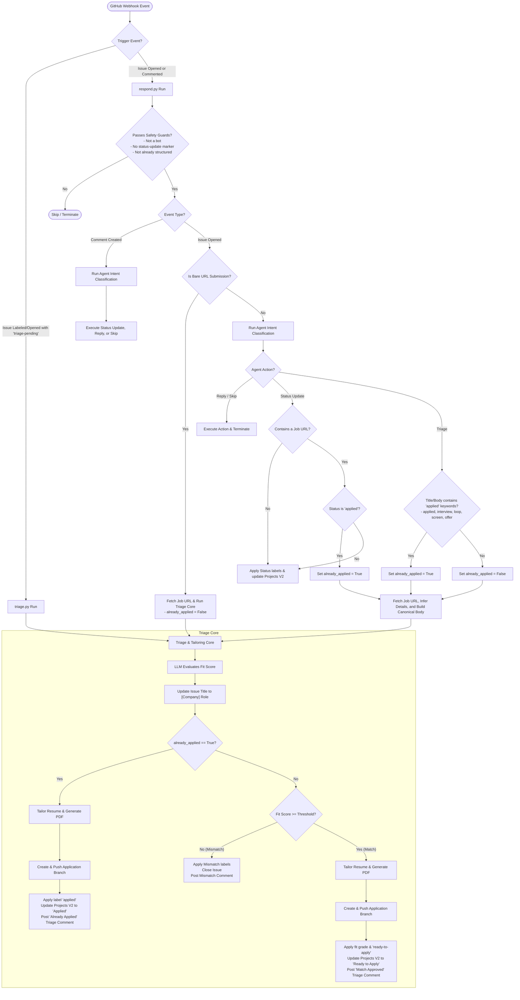

# JobGitOps Issue Triage & Response Pipeline

When an issue is opened or commented on in your `job-search` repository, the GitHub Actions workflows route the event to either the triage coordinator (`triage.py`) or the conversational responder (`respond.py`). This document explains the full decision logic.

## Pipeline Flowchart

---

## Detailed Logic Breakdown

### 1. The Entry Points
* **`triage.py` (Triage Workflow):** Triggers directly when an issue is opened or labeled with `triage-pending`. It assumes the issue contains job description details (usually structured) and immediately evaluates it.
* **`respond.py` (Response Workflow):** Triggers on any general issue opening or comment creation. It performs safety checks (ignoring bots and recursive loops) and determines the user's intent.

### 2. Intent Detection for Opened Issues
When a user opens an issue:
* **Bare URL Check:** If the issue is simply a link to a job posting (with no additional context), intent classification is bypassed. It proceeds directly to triage the URL.
* **Agent Classification:** If there is text alongside the URL, `run_agent` determines the action:
  * **Triage:** The LLM indicates the user wants to evaluate a job description.
  * **Status Update:** The LLM indicates the user is updating the status of a job (e.g. reporting they applied).
  * **Reply/Skip:** General conversation or actions that require no status/triage changes.

### 3. Intercepting the "Already Applied" Intent
If the agent detects a `status_update` to `applied` **and** a job URL is present, or if it classifies it as `triage` but the issue contains status keywords (like `"applied"`, `"interview"`, etc.):
* The pipeline flags the process with `already_applied = True`.
* Instead of running a simple status change or a standard triage, the bot fetches the URL, infers the job details, renames the issue title to `[Company] Role`, and generates the tailored resume.

### 4. Triage & Tailoring Core
During triage:
* **Mismatch Bypass:** If `already_applied` is `True`, the fit score threshold check is completely bypassed. Even if the score is low, the issue is kept open.
* **Badges and Statuses:** 
  * If `already_applied` is `True`, the issue is tagged as `applied` (moving to the **Applied** column in your Projects board), and the fit grade labels are skipped.
  * If `already_applied` is `False`, the issue is evaluated against the threshold. Approved matches get the fit grade label (e.g. `fit:B`) and the `ready-to-apply` label (moving to the **Ready to Apply** board column). Mismatches are closed.
