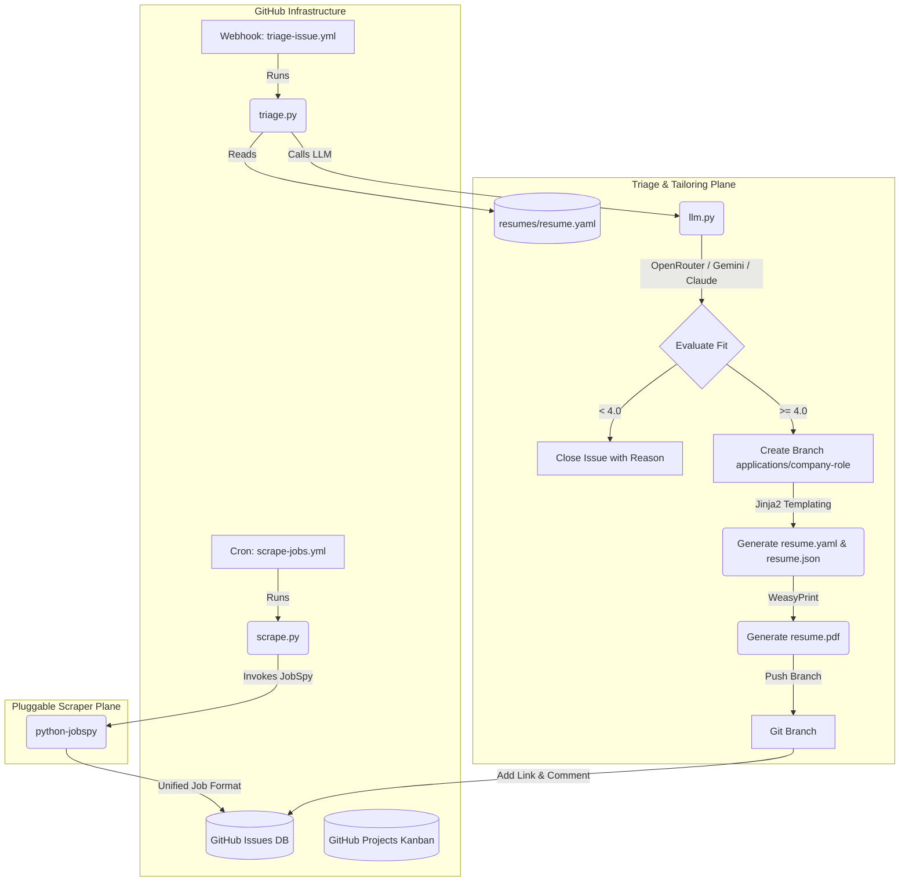

# JobGitOps Technical Specification

This document defines the architecture, data schemas, and workflows for **JobGitOps**, a serverless, GitOps-driven job application and tracking system built entirely in **Python** and managed using **Nix / devenv**.

---

## 1. System Overview

JobGitOps treats the job search like software deployment. It automates role discovery, fit-scoring, resume tailoring, and tracking using GitHub as the database and runner infrastructure.



## 1.1. Fork-and-Run User Story (Setup & Distribution)

To make JobGitOps highly accessible and easy to distribute, the system is designed to run entirely "out-of-the-box" as a personal fork using GitHub's free execution infrastructure.

### Setup Workflow for End Users:
1. **Fork the Repository:** The user forks the JobGitOps repository to their personal GitHub account.
2. **Configure Secrets:** The user adds their `GEMINI_API_KEY`, `OPENROUTER_API_KEY`, or `CLAUDE_CODE_OAUTH_TOKEN` to their repository secrets (**Settings > Secrets and variables > Actions**).
3. **Customize Resume & Preferences:**
    *   The user overwrites `resumes/resume.yaml` with their personal work history, education, and skills.
    *   The user configures search preferences (e.g. Remote vs. Onsite, location, platforms) in `config/settings.yaml`.
4. **Enable Actions:** The user navigates to the **Actions** tab in their fork and clicks *"I understand my workflows, go ahead and enable them"* (required by GitHub for all forks).
5. **Run:** The daily cron automatically begins scraping. The user can also trigger runs manually at any time using the **Run workflow** button in the Actions interface.

---

## 2. Component Specifications

> **Issue Assistant:** The conversational responder, status-transition intents, and URL triage are specified separately in [`specs/assistant-agent.md`](assistant-agent.md).

### 2.1. Job Scraper Bot
*   **Location:** `src/jobgitops/cli/scrape.py` (run via `python -m jobgitops.cli.scrape`)
*   **Role:** Runs on a scheduled GitHub Actions cron (daily at 8:00 AM) or manual dispatch (`workflow_dispatch`).
*   **Scraper Interface:** Uses the `jobspy` Python library to search LinkedIn, Indeed, and ZipRecruiter.
*   **Resume-Driven Query Generation:**
    *   The scraper dynamically generates search queries by reading the user's base resume `resumes/resume.yaml`.
    *   To avoid rate limits and scraping throttles, it limits query generation to the top 3–5 most relevant skills listed under `skills`, combining them with the most recent position title (`work[0].position`) to form targeted search terms (e.g., `[Position] [Skill]`).
    *   Queries are run sequentially with a random delay (2–5 seconds) between requests.
    *   Job freshness is limited to the last 24 hours (`hours_old: 24`) to match the daily cron run.
    *   **Custom Query Override:** If the user specifies a list of `custom_queries` in `config/settings.yaml`, the scraper will use these queries instead of generating them from the resume, allowing the user to search for roles in new tech stacks or specific domains.
*   **Configuration:** User-specific search and evaluation preferences are stored in `config/settings.yaml` (e.g., remote vs. onsite preference, location, job type, target platforms, `fit_threshold` which defaults to `3.5`, and optional `custom_queries` to override auto-generated query strings).
*   **Single-API-Call Deduplication Cache:** 
    *   To prevent hitting GitHub's Search API rate limits, the scraper makes **one API call** at startup to fetch the last 100 issues (both open and closed) from the repository.
    *   It parses the issue titles to extract existing company and role names.
    *   Scraped listings matching any cached title are skipped locally before any issues are created.
*   **Issue Creation:** New roles are opened as GitHub Issues with:
    *   **Title:** `[Company] Role Title`
    *   **Labels:** `triage-pending`
    *   **Body:** Pre-structured markdown containing the job description, location, source, application URL, and salary.

### 2.2. AI Triage & Tailoring Engine
*   **Location:** Modular structure in `src/jobgitops/` to separate concerns:
    *   `src/jobgitops/cli/triage.py`: Main event handler (parses issues, coordinates triage/tailor workflow).
    *   `src/jobgitops/llm.py`: Pluggable LLM wrapper (Gemini / OpenRouter / Claude) enforcing structured JSON schema parsing.
    *   `src/jobgitops/renderer.py`: Compiles the resume YAML using Jinja2 HTML templates and triggers WeasyPrint for PDF generation.
    *   `src/jobgitops/git_ops.py`: Encapsulates Git branch creation, checkout, staging, committing, and pushing.
    *   `src/jobgitops/github_client.py`: Interacts with the GitHub API (posting comments, labels, and Projects V2 board state updates).
*   **Two-Pass LLM Strategy (Token-Saving):**
    *   **Triage Stage:**
    *   Evaluates the job description against the base resume `resumes/resume.yaml`.
    *   Runs a structured prompt-based rubric to grade the fit from 1.0 to 5.0 across **5 granular dimensions**:
        1. *Tech Stack Match*
        2. *Experience & Years Fit*
        3. *Location & Timezone Suitability*
        4. *Salary Alignment*
        5. *Industry Domain Familiarity*
    *   The LLM output is parsed and validated using a structured JSON schema.
    *   **Pass 2 (Tailor):** If the fit score is greater than or equal to the configured threshold (specified by `fit_threshold` in `config/settings.yaml`, defaulting to `3.5`), the engine proceeds to the tailoring stage. Otherwise, the bot comments on the issue with the mismatch details, removes `triage-pending`, adds `triage-mismatched` plus one red reason label for every fit dimension scored below `3.0` (e.g. `salary-mismatch`, `location-mismatch`, `tech-stack-mismatch`, `experience-mismatch`, `industry-mismatch`; an issue may carry several), and closes the issue.
*   **Branch Naming & Sanitization:** 
    *   Spawns a clean git branch: `applications/<slugified-company>-<slugified-role>-<short-hash>`.
    *   Titles/companies are sanitized into lower-case URL-friendly slugs using strict regex to avoid invalid Git ref errors.
    *   To ensure branch uniqueness and prevent Git checkout conflicts (e.g., for duplicate titles or reposted listings), a 5-character hash of the job posting URL is appended as a suffix to the branch name.
*   **Resume Tailoring Pipeline:**
    *   Overwrites `resumes/resume.yaml` on the branch with the tailored content (enabling clean Git diff tracking against `main`).
    *   Generates a JSON version at `resumes/resume.json`.
    *   Compiles `resumes/resume.pdf` using WeasyPrint with Jinja2 rendering of `resumes/template.html` and `resumes/style.css`.
    *   Commits and pushes the files to the application branch. The bot's commit messages must follow the Conventional Commits specification (e.g., `feat(application): tailor resume for [Company] - [Role]`).
*   **Issue Comment & PDF Viewer Link:**
    *   Comments on the issue with fit scoring details and an application manual-link.
    *   Adds a direct link to the **GitHub blob view URL** of the PDF on the application branch: `https://github.com/<owner>/<repo>/blob/applications/<company>-<role>/resumes/resume.pdf` (viewable natively in browser if logged in).
    *   Updates labels to a fit tier label (`fit:A+` for scores above `4.5`, `fit:A` for scores between `4.0` and `4.5`, `fit:B` for scores between `3.5` and `4.0`) and `ready-to-apply`.

### 2.3. GitHub Projects & Lifecycle Automation
*   **Kanban Board Integration:**
    *   **Configuration:** Optional integration with **GitHub Projects V2** via `projects_v2.project_id` (the `PVT_...` node ID) and `projects_v2.status_field_name` in `config/settings.yaml`. The shipped `PVT_YOUR_PROJECT_ID` placeholder is treated exactly like an unset value, keeping a fresh clone in label-only mode until the ID is replaced.
    *   **Single Source of Truth:** Lifecycle labels and their board columns are mapped once in `src/jobgitops/status_model.py`; every script and workflow imports it so the two sides cannot drift.
    *   **Forward sync (label → column):** `status-transition.yml` listens for lifecycle label additions and moves the card via GraphQL.
    *   **Reverse sync (column → label):** `project-status-sync.yml` listens for `projects_v2_item` edits/creates and applies the matching lifecycle label. Triage Pending is excluded so dragging a card back never re-triggers an AI re-triage.
    *   **Backfill & reconciliation:** `python -m jobgitops.cli.project_sync backfill` populates the board from existing labels idempotently (skipping cards already in the correct column); `backfill --reverse` recovers column moves whose webhook event was dropped.
    *   **Fallback:** If no `projects_v2.project_id` is configured (or it is still the placeholder), the system falls back cleanly to repository labels (`ready-to-apply`, `applied`, `in-loop`, `rejected`) and does not crash.
*   **Branch/PR Strategy:**
    *   Each application branch remains open as a persistent record of the application state (acting as an open pull request). It is not merged to `main` to avoid polluting the production branch history.

---

## 3. Data Schemas

### 3.1. Unified Job Listing JSON Schema
```json
{
  "title": "Senior Python Engineer",
  "company": "Google",
  "location": "Sunnyvale, CA (Hybrid)",
  "description": "Full job description text...",
  "apply_url": "https://careers.google.com/jobs/...",
  "salary": "$150,000 - $190,000",
  "source": "LinkedIn"
}
```

### 3.2. Resume Schema (JSON Resume standard in YAML)
The base resume `resumes/resume.yaml` file must conform to the JSON Resume schema format:
```yaml
basics:
  name: "John Doe"
  email: "john@example.com"
  phone: "123-456-7890"
  website: "https://johndoe.dev"
  summary: "A brief summary..."
work:
  - name: "Acme Corp"
    position: "Senior Engineer"
    startDate: "2022-01-01"
    endDate: "2024-06-01"
    highlights:
      - "Built scalable services..."
skills:
  - name: "Languages"
    keywords:
      - "TypeScript"
      - "Python"
```

---

## 4. GitHub Actions Workflows

Both workflows run inside our reproducible Nix/devenv environment, avoiding runner `apt-get` system library installation delays.

### 4.1. `scrape-jobs.yml`
*   **Trigger:** Daily cron schedule (`0 8 * * *`) or manual dispatch (`workflow_dispatch`). Manual runs support optional inputs (e.g., override location or custom search queries) for ad-hoc debugging and manual runs, defaulting to standard configuration files if left blank.
*   **Jobs:**
    1.  Sets up Nix and devenv using `cachix/install-nix-action` and `cachix/devenv-action` with caching enabled (caching the Nix store and virtual environment dependencies).
    2.  Runs the scraper task: `devenv shell python -m jobgitops.cli.scrape`.

### 4.2. `triage-issue.yml`
*   **Trigger:** `issues` opened with `triage-pending` label.
*   **Jobs:**
    1.  Sets up Nix and devenv using `cachix/install-nix-action` and `cachix/devenv-action` with caching enabled.
    2.  Runs triage: `devenv shell python -m jobgitops.cli.triage` with `GEMINI_API_KEY`, `OPENROUTER_API_KEY`, or `CLAUDE_CODE_OAUTH_TOKEN`, and `GITHUB_TOKEN`.

---

## 5. Testing, Linting & Quality Assurance

To enforce quality standards, local validation, and runner test checks:

### 5.1. Nix Environment Configuration
*   **`devenv.nix`**: Defines the environment:
    *   Python 3.11+
    *   System dependencies for WeasyPrint (`pkgs.cairo`, `pkgs.pango`, `pkgs.gobject-introspection`, `pkgs.libffi`, `pkgs.fontconfig`, and system fonts).
    *   `languages.python` enabled with virtualenv mapping `requirements.txt`.
*   **`.envrc`**: Configured with `use devenv` for seamless local `direnv` environment loading.

### 5.2. Test Setup & Enforcement
*   **Framework**: `pytest` and `pytest-cov` for coverage reporting.
*   **Coverage Rules**: Enforce a strict minimum of **90% test coverage** for all files inside `src/`.
*   **Linting & Formatting**: `ruff` for fast codebase verification.
*   **Quality Gate (`Justfile`)**: A `Justfile` provides the local check execution:
    ```just
    validate:
        ruff check .
        ruff format --check .
        pytest --cov=src --cov-fail-under=90 tests/
    ```
*   **CI Pipeline Validation (`.github/workflows/ci.yml`)**: Launches on every push and pull request to run `just validate` within the pre-built Docker container environment before any changes can be merged.
